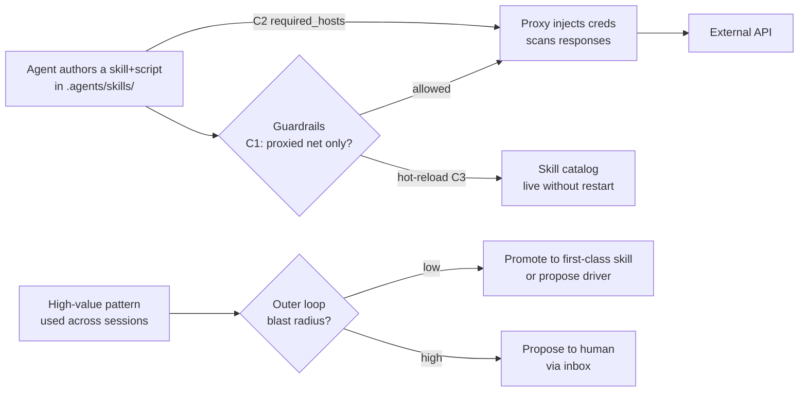

# Extension Tiers — The Capability-Growth System

> gctrl's extension model has a missing tier. Skills carry *knowledge* but no
> new I/O; drivers carry *capability* but require a kernel rebuild and a human.
> The gap between them — **userspace capability an agent can author itself** —
> is what makes a self-improvement loop actually grow capability instead of
> just retuning existing capability.

**Status:** design analysis + decision. Implementation tracked in `gctrl/ROADMAP.md`.

This spec extends the layer model in [os.md](os.md) (§4 Utilities, §5 Drivers)
with a cross-cutting view: not "what layer does X live in" but "**who can add a
new capability, and how fast does it land**." Prompted by analysis of Centaur
(Paradigm / Tempo, May 2026) — see [comparison.md § gctrl vs. Centaur](../comparison.md).

---

## 1. The tiers, viewed by capability and authorship

| Tier | New I/O capability? | Author | Lands live by | Trust model |
|---|---|---|---|---|
| **Skill** | No — procedural knowledge only | Agent or human | Drop `SKILL.md` | Read-only instructions; safe by construction |
| **Skill + `scripts/`** | *Latent* — a bundled script can call out | Agent or human | Drop file | **Currently blocked** — guardrails don't grant agent-authored scripts network access |
| **Driver (LKM)** | Yes | **Human only** | Rust crate → compile → ship kernel | Kernel-integrated; full secret access |
| **App** | Yes (owns domain data) | **Human only** | TS package → deploy | Owns namespaced tables |

The two tiers an agent can author (Skill, Skill+scripts) **cannot grant a new
external capability today.** The two tiers that *can* (Driver, App) are
**human-only and slow** (compile/deploy). So an agent's self-improvement is
structurally capped: it can change *how it uses what it already has* (prompts,
skill selection, scope) but cannot give itself a new integration.

Centaur's "tool" (a Python class dropped in `tools/`, auto-discovered,
hot-reloaded, declaring its required hosts/creds) sits exactly in the empty
cell: **userspace capability the agent can author.** That single tier is *why*
Centaur's nightly reflection can ship a genuinely new integration while gctrl's
outer loop can only retune.

## 2. gctrl is three connectors away, not a subsystem away

The pieces for the missing tier already exist; they are simply not wired
together:

1. **Skills already bundle executables.** `SKILL.md` permits `scripts/` and
   `assets/` ([skills.md §1](skills.md)). A skill with a `scripts/fetch_foo.sh`
   *is* a userspace tool in embryo.
2. **The proxy can make agent-authored network calls safe.** A script the agent
   wrote is untrusted — you cannot hand it `GITHUB_TOKEN`. But if its egress
   routes through the credential-injecting proxy
   ([proxy-credential-injection.md](kernel/proxy-credential-injection.md)), the
   script never sees a secret, and response bodies are scanned for leaks. The
   proxy is not merely a security feature — **it is the enabling substrate for
   agent-authored tools.**
3. **The outer loop already promotes patterns.**
   [outer-improvement-loop.md](outer-improvement-loop.md) defines the
   auto-apply / propose-to-human boundary that decides when an agent-authored
   tool graduates to a first-class, reviewed capability.

The three connectors needed:

| # | Connector | Where |
|---|---|---|
| C1 | A guardrail capability that permits an agent-authored script to make **proxied** network calls (and *only* proxied — direct egress stays denied) | `gctrl-guardrails` + `allowed-tools` grammar |
| C2 | A manifest convention for a skill/script to declare `required_hosts` (Centaur's `pyproject.toml` field, directly portable) so the proxy knows which secret rules apply and the kernel can warn on missing creds | `SKILL.md` frontmatter |
| C3 | Hot-reload of the skill catalog on FS events so an agent-authored tool is live without a daemon restart | orchestrator dispatch path ([skills.md §3.2](skills.md)) |

## 3. The composed system

These are not four features. They are one **capability-growth loop**:

Read it as a lifecycle: an agent writes a tool → guardrails permit it under a
constrained (proxy-only) network policy → the proxy makes it safe → it
hot-reloads → if it proves valuable across sessions, the outer loop promotes it
(or proposes a human-authored driver when it needs deeper kernel integration).
Capability *grows* — and the kernel-invariant boundary
([outer-improvement-loop.md § kernel-invariant surface](outer-improvement-loop.md))
still holds, because the agent never writes a driver, never touches guardrail
*policy code*, never sees a secret.

## 4. Why keep the human-only driver tier at all

The missing tier does not abolish drivers. The two coexist by design:

- **Userspace tool (agent-authored):** ad-hoc, fast, sandboxed, proxy-mediated,
  no kernel state. The agent's REPL for capability. Cheap to create, cheap to
  discard. No OTel-deep integration, no typed error channel.
- **Driver (human-authored LKM):** durable, typed, kernel-integrated, OTel
  spans, secret injection at the kernel boundary, caching. The capability worth
  hardening.

The promotion path *is* the relationship: a userspace tool that proves its
worth across many sessions is the **evidence** that a driver should be written.
The outer loop surfaces "this proxied-script pattern appears in N sessions →
propose a `driver-foo`." Agents discover capability cheaply in userspace; humans
harden the winners into the kernel. This mirrors the Unix path from a shell
script to a compiled coreutil.

## 5. Non-goals / boundaries

- **No arbitrary agent code execution outside the sandbox.** Userspace tools run
  in the per-session compute sandbox
  ([compute-cf-containers.md](../implementation/kernel/compute-cf-containers.md)),
  not on the host. Filesystem isolation is the container's job; network
  isolation is the proxy's.
- **No direct egress for agent-authored scripts — ever.** C1 grants *proxied*
  network access only. A script attempting direct egress is denied. This is what
  keeps "the agent wrote this code" compatible with "secrets are never exposed."
- **Agents never author drivers, apps, guardrail policy, or secret rules.** Those
  remain human-only (see [outer-improvement-loop.md](outer-improvement-loop.md)).
- **No tool marketplace.** Same stance as skills ([skills.md § Non-goals](skills.md)).

## 6. References

- [os.md](os.md) — the layer model this extends (§4 Utilities, §5 Drivers).
- [skills.md](skills.md) — skill format; `scripts/` bundling; hot-reload (C3).
- [kernel/proxy-credential-injection.md](kernel/proxy-credential-injection.md) —
  the substrate that makes agent-authored network calls safe (C2 maps to its
  secret rules).
- [outer-improvement-loop.md](outer-improvement-loop.md) — promotion path and
  kernel-invariant boundary.
- [comparison.md § gctrl vs. Centaur](../comparison.md) — Centaur's `tools/`
  tier that prompted this analysis.
