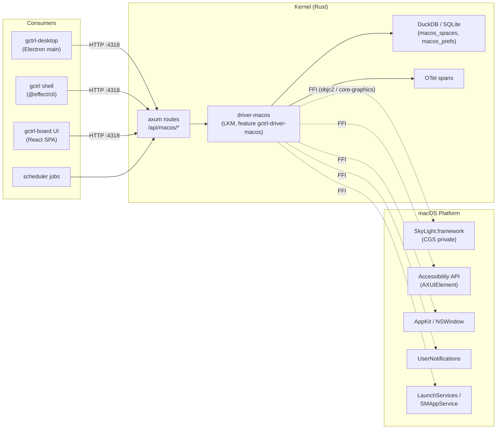

# `driver-macos` — macOS Platform Driver

`driver-macos` is a feature-gated kernel module (LKM) that exposes platform-specific capabilities of the host operating system to gctrl when the kernel is running on macOS. It follows the [driver model in os.md](../os.md#kernel-interfaces-for-external-apps) — same shape as `driver-github` or `driver-linear` — but its "external system" is the local OS rather than a remote SaaS.

The headline use case in v1 is **named Mission Control Spaces** for the [gctrl Desktop app](../apps/gctrl-desktop.md): assign a recognizable label (`gctrl`, `code`, `inbox`, …) to a macOS Space so the user can identify it in Mission Control, App Exposé, and via the Control-Strip switcher — working around the fact that macOS does not let you rename "Desktop 1", "Desktop 2", etc.

This document defines the architectural position, the kernel interface, the boundaries with the Electron desktop shell, and the platform-feature surface the driver owns. Concrete FFI bindings, entitlements, and crate layout live in [implementation/kernel/driver-macos.md](../../implementation/kernel/driver-macos.md).

## Why a kernel driver, not Electron-side code

The macOS shell already exists (the Electron main process). It would be tempting to put platform integration there. We don't, for the same reasons GitHub access lives in `driver-github` instead of the shell:

1. **The kernel is the only long-running process the user always has.** The Electron app may be closed; CLI users (`gctrl serve` standalone) never spawn Electron at all. Platform features that need persistent state (e.g. "this Space is named `inbox`") must outlive any single GUI process.
2. **One contract for all surfaces.** The shell, the gctrl-board UI, the gctrl-desktop menu, future menu-bar utilities, and recurring scheduler jobs all consume macOS features through the same `/api/macos/*` HTTP routes. The driver is the single place that owns the unsafe FFI, the entitlement requirements, and the version-skew handling.
3. **Telemetry and caching come for free.** The kernel wraps each driver call in an OTel span and a TTL cache, the same way [os.md § Driver Execution Model](../os.md#driver-execution-model--kernel-responsibilities) describes for `driver-github`. A "list spaces" call that returns 30 ms of CGS data behaves identically to a 600 ms `gh issue list` call from the consumer's perspective.
4. **Cross-module isolation stays intact.** [Driver rule #6](../os.md#driver-rules) forbids drivers from importing each other or from native apps. Putting macOS code in Electron would create a back-channel where the shell mutates platform state outside the kernel's view; that breaks the dependency direction defined in [os.md](../os.md).

> **What stays in Electron:** anything that requires being inside the GUI process (Dock badge text, NSDockTile customization, native menu bars, drag-and-drop targets). These are renderer/main concerns and continue to live in `apps/gctrl-desktop/src/main/`. The driver owns features that any process can request and that need to survive past the Electron app's lifetime.

## Architectural Position



Three things this picture pins:

- **The driver is the only crate that links Apple frameworks.** No other gctrl crate may add `objc2` or `core-graphics` dependencies. If a feature can't be satisfied by the driver's HTTP routes, the answer is to add a route, not to bypass.
- **Persistent state is in kernel storage, not in plists or `defaults`.** Named-space mappings live in DuckDB so they survive macOS upgrades, are visible to non-GUI consumers, and sync via the existing kernel sync pipeline (see [sync.md](sync.md)).
- **The driver is gated behind `cfg(target_os = "macos")` AND a Cargo feature flag.** A Linux build of gctrl never compiles `driver-macos`; a macOS build with `--no-default-features` doesn't either. This keeps the kernel binary portable and matches [driver rule #4](../os.md#driver-rules).

## Kernel Interface

The driver implements a new trait `PlatformPort` defined in `gctrl-core`. Unlike `TrackerPort` or `ObservabilityExportPort`, `PlatformPort` is **single-implementation per OS** — only one platform driver is loaded for a given target — and the trait is a discriminated union of capability sub-traits the driver opts into.

```rust
// kernel/crates/gctrl-core/src/platform.rs   (sketch)
pub trait PlatformPort: Send + Sync {
    fn os(&self) -> Os;                       // Os::MacOS, Os::Linux, ...
    fn capabilities(&self) -> CapabilitySet;  // bitset; consumers feature-detect
    fn spaces(&self) -> Option<&dyn SpacesPort>;
    fn notifications(&self) -> Option<&dyn NotificationsPort>;
    fn login_items(&self) -> Option<&dyn LoginItemsPort>;
    fn power(&self) -> Option<&dyn PowerPort>;
}
```

Capabilities are advertised at runtime, not at compile time, because they depend on entitlements granted by the user (see [Permissions](#permissions)). A driver with no Accessibility permission MUST return `None` from `spaces()` rather than panicking on the first call.

### `SpacesPort` (v1)

The v1 surface needed for the headline feature.

```rust
pub trait SpacesPort: Send + Sync {
    fn list(&self) -> Result<Vec<Space>, PlatformError>;
    fn current(&self) -> Result<Space, PlatformError>;
    fn name(&self, space_id: SpaceId, name: &str) -> Result<(), PlatformError>;
    fn unname(&self, space_id: SpaceId) -> Result<(), PlatformError>;
    fn switch_to(&self, space_id: SpaceId) -> Result<(), PlatformError>;
    fn watch(&self) -> BoxStream<'static, SpaceEvent>;  // SSE-friendly
}

pub struct Space {
    pub id: SpaceId,           // stable across the macOS session
    pub display_id: u32,       // which display this Space lives on
    pub index: u32,            // order in Mission Control (1-based)
    pub kind: SpaceKind,       // User | Fullscreen | Tiled
    pub name: Option<String>,  // gctrl-assigned label, persisted in DuckDB
    pub system_label: String,  // "Desktop 1", "Desktop 2" — what macOS calls it
    pub is_current: bool,
}
```

`SpaceId` is opaque: internally a `u64` derived from the CGS private space identifier, but consumers MUST treat it as an unhashable token. The IDs are stable within a login session and re-emitted on `loginwindow` reset; the driver re-keys persisted mappings using a `(display_uuid, index)` fallback when CGS IDs change after a reboot or display reconfiguration.

### Other capability ports (planned, not v1)

| Port | Purpose | macOS surface |
|---|---|---|
| `NotificationsPort` | Native banner notifications with a stable identifier so kernel events can update/dismiss prior banners | `UNUserNotificationCenter` |
| `LoginItemsPort` | "Start gctrl on login" toggle, used by `gctrl serve --install` | `SMAppService` |
| `PowerPort` | Sleep/wake + thermal-pressure observation, fed into `driver-llm` for local-model heat throttling | `IOPMrootDomain`, `NSProcessInfo.thermalState` |
| `ScreenCapturePort` | One-shot screenshots for session evidence (the existing browser driver covers full-page web capture) | `ScreenCaptureKit` |

These appear on the roadmap but are out of scope for the v1 spec; the trait split exists so they can land independently without churning consumers of `SpacesPort`.

## Headline Feature: Named Mission Control Spaces

### User story

> *As a gctrl Desktop user with multiple macOS Spaces, I want each Space to show a recognizable name in Mission Control (e.g. `gctrl`, `code`, `slack`) instead of "Desktop 1", "Desktop 2", so I can switch contexts without counting indexes.*

### Behavior

- The user opens `gctrl-board` → Settings → "macOS Spaces" panel (or runs `gctrl macos spaces name <space> <label>`). The driver records `(SpaceId, label)` in DuckDB and immediately reflects the label.
- On Mission Control invocation, each named Space displays its gctrl label overlaid on the standard "Desktop N" thumbnail. Unnamed Spaces remain untouched.
- The label persists across logout, reboot, and macOS minor upgrades. Across major upgrades or display reconfiguration, the driver re-resolves IDs using a `(display_uuid, index)` fallback (see [SpaceId stability](#spaceid-stability) below).
- A name is removed via `gctrl macos spaces unname <space>` or by setting an empty string; Mission Control returns to the default labelling immediately.

### Implementation strategy — AX overlay only

The driver uses one approach: watch for Mission Control activation via an `AXObserver` on the Dock; when it activates, draw a transparent borderless `NSWindow` per display with one label per Space thumbnail. The label sits above Mission Control's own UI, click-through, hidden again on dismissal.

The kernel-level architecture (HTTP routes, schema, capability advertisement) does not depend on the rendering technique. The implementation spec captures the FFI surface, the thumbnail-rect layout function, and version-skew detection.

**Alternatives considered and rejected:**

| Approach | Why rejected |
|---|---|
| **Sentinel windows** (donate a helper window's `title` to Mission Control) | Doesn't actually deliver the user-visible label. macOS hard-codes the Space caption as "Desktop N" for regular user Spaces regardless of which windows are inside; window titles surface only as window-thumbnail captions, not as the Space caption. The technique works only for fullscreen Spaces, which are owned by an app, not the user. |
| **`SLSSpaceSetName`** (private write API in `SkyLight.framework`) | Renames the Space cleanly at WindowServer level, but: (a) signature has changed across macOS releases; (b) ineligible for Mac App Store; (c) entitles us to a maintenance burden we don't need given AX overlay covers the case. |
| **Fullscreen "labeller" app** per Space | Would set the Space's caption to the labeller app's name, but takes over the entire Space — destructive to the user's actual workflow. |

**Implication:** the feature requires Accessibility permission. Without it, `capabilities` does not include `spaces` and the UI surfaces a "grant Accessibility" CTA instead of a degraded experience. This is the honest design — the user either grants permission and gets named Spaces, or the feature is unavailable.

### Out of scope for v1

- Naming Spaces on **secondary displays** that are hot-plugged after the driver starts. These are detected and labelled correctly on the next display-configuration event, but live re-labelling during plug/unplug events is not in v1.
- Naming **fullscreen-app spaces** (the per-app spaces that appear when Cmd-Ctrl-F'ing). These are owned by the app, not the user, and naming them yields confusing semantics (the name vanishes when the user exits fullscreen). The driver returns these from `list()` with `kind: Fullscreen` but rejects `name()` calls with `PlatformError::Unsupported`.
- Cross-machine sync of Space labels. Out of scope: Space IDs are local. The driver stores `(machine_id, space_id, label)` so [sync.md](sync.md) explicitly skips this table when syncing across hosts. Future work: sync by `(label, role)` so `inbox` on one Mac maps to whichever Space the user designates as `inbox` on another.

## HTTP API

```
GET  /api/macos/health                      → driver capability set + permission status
GET  /api/macos/spaces                      → Vec<Space>
GET  /api/macos/spaces/current              → Space
POST /api/macos/spaces/{id}/name            { name: string }   → 204
DELETE /api/macos/spaces/{id}/name                              → 204
POST /api/macos/spaces/{id}/switch                              → 204
GET  /api/macos/spaces/stream               → SSE: SpaceEvent
```

All write routes invalidate the `GET /api/macos/spaces` cache, mirroring [`gh pr create`'s cache invalidation in driver-github](../../implementation/dogfood-drivers.md#ccli-gh--typed-gap-fill).

`GET /api/macos/health` is the discovery endpoint — consumers (Electron app banner, gctrl-board settings panel) call it on startup to feature-detect and to surface a "grant Accessibility" CTA when permissions are missing.

```jsonc
// example response
{
  "os": "macos",
  "version": "15.2",
  "capabilities": ["spaces", "notifications"],
  "permissions": {
    "accessibility": "granted",
    "notifications": "denied",
    "screen_recording": "not_requested"
  }
}
```

## Permissions

The driver explicitly requests permissions on first use, surfaces denial states through `/api/macos/health`, and never silently degrades. The Electron app's settings panel renders a per-permission CTA card backed by the health response.

| Capability | macOS permission | Where the prompt appears |
|---|---|---|
| `spaces` | Accessibility (`kAXTrustedCheckOptionPrompt`) | First call to `name()`; deferred until needed. Without this, `spaces` is not in `capabilities` and `name()` returns `PermissionDenied`. |
| `notifications` | `UNAuthorizationStatus` | First call to post a notification |
| `screen_capture` (planned) | `CGRequestScreenCaptureAccess` | First call |

The driver MUST NOT prompt for any permission at kernel startup. Prompts are tied to user-initiated actions only; kernel boot stays silent and headless, consistent with the local-first principle in [principles.md](../../principles.md).

## SpaceId Stability

CGS Space IDs are stable within a `loginwindow` session and not stable across reboots. To make persisted labels durable, the driver maintains two indexes:

- **Hot index**: `(SpaceId → Label)` rebuilt on each kernel start by walking `SLSCopyManagedDisplaySpaces`.
- **Cold index**: `(machine_id, display_uuid, monotonic_index, kind) → Label` persisted in DuckDB (`macos_space_labels`).

On startup, the driver enumerates current Spaces, then maps each into the cold index by `(display_uuid, index, kind)`. Re-association is best-effort: if the user reordered Spaces between sessions, labels follow the index, not the previous CGS ID. This matches user mental models (people remember "the third Space on my main monitor", not opaque IDs) and avoids stale labels migrating to the wrong Space after a reboot.

`(machine_id, display_uuid, ...)` keying ensures a Time Machine restore onto a different Mac doesn't carry over labels for a display that no longer exists. The `machine_id` is the same one used by [sync.md](sync.md) for endpoint identification.

## Storage Schema

```sql
CREATE TABLE macos_space_labels (
  machine_id   TEXT NOT NULL,
  display_uuid TEXT NOT NULL,
  space_index  INTEGER NOT NULL,
  space_kind   TEXT NOT NULL,           -- 'user' | 'fullscreen' | 'tiled'
  label        TEXT NOT NULL,
  cgs_id_hint  BIGINT,                  -- last-known CGS id; informational
  created_at   TIMESTAMP NOT NULL DEFAULT now(),
  updated_at   TIMESTAMP NOT NULL DEFAULT now(),
  PRIMARY KEY (machine_id, display_uuid, space_index, space_kind)
);

CREATE INDEX macos_space_labels_label ON macos_space_labels (label);
```

Naming follows the `{driver}_*` convention from [driver-github's tables](../../implementation/dogfood-drivers.md). Labels are unique only within a `(machine_id, display_uuid)` scope, not globally, so `inbox` on the laptop and `inbox` on the studio Mac coexist.

## Failure Modes

| Symptom | Driver behavior | Surfaced to consumer as |
|---|---|---|
| User has not granted Accessibility | `capabilities` excludes `spaces`; `name()` returns `PermissionDenied` | `permissions.accessibility = "denied"` in `/health`; UI shows "grant Accessibility" CTA |
| `SkyLight.framework` symbols missing on a future macOS | Driver detects via `dlsym` probe at startup, downgrades capability | `capabilities` omits `spaces`, banner in Electron CTA |
| Mission Control thumbnail-rect layout doesn't match the snapshot fixture (macOS major bump) | Driver detects mismatch, downgrades capability with `version_skew=true` | `capabilities` omits `spaces`; user sees "incompatible macOS version, update gctrl" |
| Display unplugged mid-call | Returns `PlatformError::DisplayGone`; cold index entries kept (re-bind on next plug) | 410 Gone |
| User invoked Mission Control before label was applied | Re-overlay on next activation | n/a — eventual consistency |
| Two Mission Control activations in <100 ms | Coalesce overlays | n/a |

`PlatformError` is a `Schema.TaggedError` per [arch-taste.md § Type-Safe Error Handling](../../../../debuggingfuture/arch-taste.md#type-safe-error-handling), with variants `PermissionDenied`, `Unsupported`, `DisplayGone`, `VersionSkew`, and `Underlying { source }`.

## Testing

| Layer | Where | What |
|---|---|---|
| Unit | `kernel/crates/gctrl-driver-macos/src/**/__tests__` | Pure logic — cold-index keying, label re-association, error mapping. No FFI. |
| Integration | `kernel/crates/gctrl-driver-macos/tests/spaces_smoke.rs` | Behind `#[cfg(target_os = "macos")]` and `--features integration-macos`. Exercises real CGS reads on a developer machine; skipped in CI by default. |
| Acceptance | `apps/gctrl-desktop/tests/acceptance/macos-spaces.spec.ts` | Playwright drives the packaged `.app`, asserts that `/api/macos/spaces` returns ≥1 space and that naming a space round-trips through `/health` and persistence. |
| Soak | n/a v1 | A future job hammers Mission Control activation 10×/min for an hour to surface AX-observer leaks. |

## Compatibility Matrix

| macOS | AX overlay | Notes |
|---|---|---|
| 13 Ventura | supported | minimum version; matches gctrl-desktop's `LSMinimumSystemVersion` |
| 14 Sonoma | supported | |
| 15 Sequoia | supported | tested target for v1 ship |
| 16 (next) | feature-detect at startup; capability advertised only if layout fixture matches | a macOS major bump that moves thumbnail rectangles is shipped as a gctrl point release with an updated fixture |

When the driver detects an unsupported macOS, it logs a `WARN` span with `version_skew=true` and downgrades `capabilities`. Consumers MUST honor the `capabilities` array rather than assuming a capability exists because the OS is macOS.

## Security & Privacy

- The driver runs in the kernel process, which is **already trusted** with full user privilege (it spawns subprocesses, owns the DuckDB file, holds GitHub PATs). Adding macOS FFI does not expand the trust boundary.
- The driver MUST NOT log Space labels (they may contain `client-acme` or `personal`) at INFO. Labels go in DEBUG spans gated on the existing `gctrl-otel` redaction rules.
- The driver MUST NOT request **Full Disk Access**, **Screen Recording**, or **Input Monitoring** entitlements unless a future capability explicitly needs them. v1 needs only Accessibility.
- The Electron app's `entitlements.mac.plist` is unaffected — the kernel sidecar is a separate signed binary and carries its own entitlements file (added in the implementation spec).

## Out of Scope

- **Other OSes.** A `driver-linux` (Wayland labels via `ext-foreign-toplevel-list-v1`) and `driver-windows` (Virtual Desktop names via `IVirtualDesktopManagerInternal`) are obvious follow-ups but not part of this spec.
- **Window-manager features.** Tiling, focus management, and per-Space app pinning belong in a separate `WindowManagementPort` if we ever build them. The driver does not become Yabai.
- **Spotlight / Shortcuts / AppleScript surfaces.** Exposing the driver to Apple's automation frameworks is a UX choice on top of the HTTP surface; it does not require new architecture.

## Related

- [os.md § Drivers](../os.md#drivers-loadable-kernel-modules) — driver model and rules
- [gctrl-desktop.md](../apps/gctrl-desktop.md) — desktop architecture; main consumer of `driver-macos`
- [implementation/kernel/driver-macos.md](../../implementation/kernel/driver-macos.md) — concrete crate layout, FFI choices, entitlements
- [implementation/dogfood-drivers.md](../../implementation/dogfood-drivers.md) — driver execution patterns to mirror
- [sync.md](sync.md) — why Space labels stay machine-local
