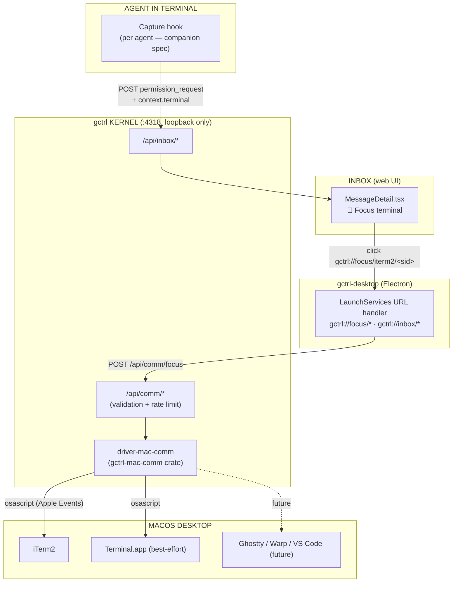
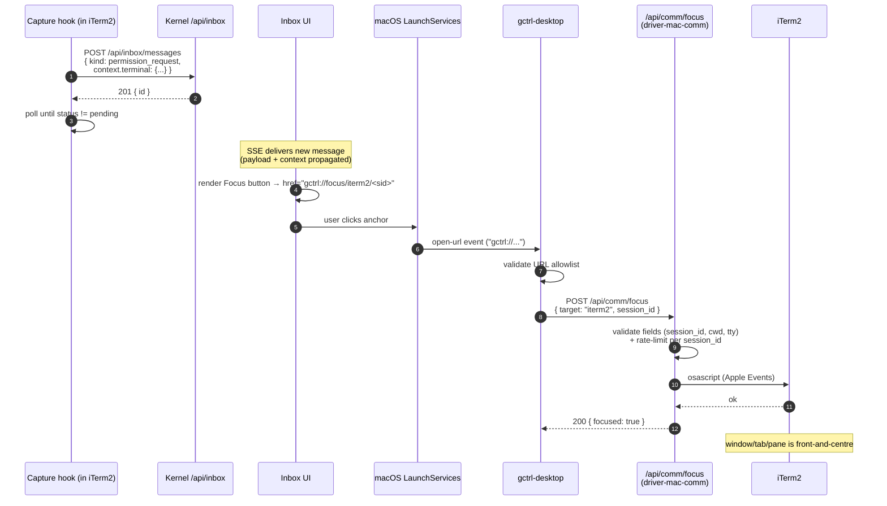

# macOS Communication (gctrl-mac-comm)

> Native macOS bridge between gctrl-inbox and the active terminal/session that produced an agent request. Click a deeplink in the inbox; the OS focuses the exact iTerm2 window/tab/pane the agent is blocked in.

> **Companion**: agent-side capture (Claude Code, Cursor, Aider, …) is specified separately in [cc-permission-hook.md](../apps/cc-permission-hook.md). This spec covers the kernel driver and the deeplink path only.

---

## Problem

Today, when Claude Code (or any other agent) running in iTerm2 hits a permission gate, it prints to its own terminal and blocks. With [gctrl-inbox](../apps/gctrl-inbox.md), the request can be routed to the inbox feed for triage — but the human still has to manually find which of N open iTerm2 windows / tabs / panes issued the request, then `cmd-tab` back, scroll, and answer.

That hunt-the-window step is friction the OS layer should remove. The inbox already knows *who* asked and *what* they asked; it does not yet know *where they are running* or have any way to send the user back there with a single click.

This spec closes the loop with two native channels, M0 and M1 respectively:

1. **A `gctrl://` URL scheme** registered on macOS, so an inbox message can render an anchor that, when clicked, focuses the originating iTerm2 session via Apple Events. (M0)
2. **`UNUserNotificationCenter` banners** for high-urgency requests, so the user can act even when the inbox UI is not foreground. (M1)

---

## Goals

1. Inbox messages from terminal-bound agents carry enough identity (`context.terminal`) for the kernel to focus the originating session.
2. Use **native macOS channels** — LaunchServices URL schemes, Apple Events, User Notifications — rather than reinventing IPC.
3. Driver lives in the **kernel** as a normal LKM (`gctrl-mac-comm`); shell and apps consume it over HTTP per the OS layering invariant.
4. Extensible to other terminals (Apple Terminal, Ghostty, VS Code, Warp) via a typed `terminal.app` discriminator.

---

## Non-Goals

- **Cross-platform** (Linux/Windows) in M0. The schema names channels generically (`focus`, `notify`) so a future Linux/`xdotool` or Windows/`SendInput` adapter can sit behind the same API.
- **Bidirectional streaming** between inbox and terminal (live tail, sending keystrokes). Out of scope; would be a separate `gctrl-tty` driver.
- **Replacing the inbox web UI** — the deeplink complements; it does not bypass.
- **Agent-side capture wiring** (e.g., the Claude Code `PreToolUse` hook) — split into [cc-permission-hook.md](../apps/cc-permission-hook.md) so each agent framework can have its own integration spec.
- **macOS sandboxing of the kernel daemon** — `gctrld` runs as a launchd LaunchAgent with full user permissions today, and that does not change.

---

## Success Criteria

| Metric | Source | Target |
|---|---|---|
| `comm.focus outcome=ok` rate over a 30-day window | OTel span (`gctrl-otel`) | ≥ 90% |
| Click → window raised, p95 latency | OTel span `comm.duration_ms` | ≤ 500 ms (osascript path) |
| `permission_request` messages from a terminal that include `context.terminal` | inbox SSE sample over 7 days | ≥ 95% (gap = agent without a capture hook) |
| `osascript` injection findings in PR-1 review | code review by Security persona | 0 |
| Daily users who reach the originating terminal in ≤ 1 click after inbox open | UI telemetry | ≥ 80% |

These are the bar for declaring this feature delivered. Each metric ties to an existing OTel attribute or an inbox SSE field — no new instrumentation is needed beyond what PR-1/PR-3 already add.

---

## Architecture

### Layering



### End-to-End Sequence



---

## Native macOS Channels Used

| Channel | Used For | Why |
|---|---|---|
| **LaunchServices URL Schemes** (`CFBundleURLTypes` / `app.setAsDefaultProtocolClient`) | Routing `gctrl://...` clicks to gctrl-desktop | OS-level — works from any browser, embedded webview, or `open(1)`. No web-side bridging needed. |
| **Apple Events / `osascript`** | Focusing iTerm2 sessions and Terminal.app tabs | Documented automation surface; supported by every major macOS terminal. Subprocess invocation (no string concat — argument-array form). |
| **`UNUserNotificationCenter`** (M1) | Native banner with a "Focus" action button — fires the same `gctrl://` URL | Lets the user respond from outside the inbox UI. Modern API; no Info.plist key needed (prompt fires on first `requestAuthorization`). |
| **`NSWorkspace.shared.open(_:)`** | Programmatic URL invocation from the driver (fallback when triggered server-side) | Standard Cocoa entry-point; respects user's default-app mappings. |
| **Process env: `ITERM_SESSION_ID`, `TERM_PROGRAM`, `TERM_PROGRAM_VERSION`** | Terminal-identity capture inside the agent process | Stable on iTerm2 (`ITERM_SESSION_ID`); `TERM_PROGRAM` is the cross-terminal discriminator. |
| **`launchd` LaunchAgent** (existing) | Hosts `gctrld` so the kernel HTTP API is up before any inbox click happens | No change. Code-sign + Hardened Runtime required (see Security). |

Channels deliberately **not** used:

- **iTerm2 Python API** — considered for M1; dropped after review. `osascript` subprocess is auditable, requires no Python runtime, and the 2 s timeout already covers the worst case. Revisit only on a profiling signal (>200 ms p95 click→raise).
- **NSDistributedNotificationCenter / XPC** — wider blast radius than needed when the kernel already exposes a localhost HTTP API.
- **`osascript:` URI scheme** — rejected fallback. That scheme executes arbitrary AppleScript with zero prompt and is not registered for any reason in this design.
- **iTerm2 OSC 1337 escape sequences** — those are *for the terminal to receive*, not to focus it from outside.

---

## Terminal Identity Capture

### Schema: `inbox_messages.context.terminal` (not `payload`)

The inbox PRD already declares `context` as a JSON object holding cross-kind references (`session_id`, `issue_key`, `project_key`, `agent_name`, `command`, `cost_usd`). Terminal identity is **not kind-specific** — `permission_request`, `agent_question`, `eval_request` and any future kind from a terminal-bound agent benefit equally. So `terminal` lives in `context`, not `payload`:

```json
{
  "context": {
    "session_id": "sess_2x9k…",
    "issue_key":  "BACK-42",
    "command":    "git push --force",
    "terminal": {
      "app":             "iterm2",
      "bundle_id":       "com.googlecode.iterm2",
      "session_id":      "w0t0p0:6F3D8E7C-1234-4ABC-9876-FEDCBA098765",
      "tty":             "/dev/ttys003",
      "pid":             47213,
      "ppid":            47200,
      "cwd":             "/Users/v/workspaces/ohc/gctrl",
      "term_program":    "iTerm.app",
      "captured_at":     "2026-05-02T14:30:01Z"
    }
  }
}
```

| Field | Source (in capture hook) | Required | Validation regex (applied at kernel intake) |
|---|---|---|---|
| `app` | derived from `TERM_PROGRAM` | yes | `iterm2\|terminal\|ghostty\|vscode\|warp\|unknown` |
| `bundle_id` | static map per `app` | yes | `[a-z][a-z0-9.-]{2,63}` |
| `session_id` | `$ITERM_SESSION_ID` (iTerm2) | when `app != unknown` | `[wtp][0-9]{1,4}:[A-Fa-f0-9-]{36}` (iTerm2 shape); `[A-Za-z0-9_:-]{1,64}` for other terminals |
| `tty` | `tty(1)` | best-effort | `/dev/(tty\|pty)[a-z0-9]{1,8}` |
| `pid` / `ppid` | `getpid` / `getppid` | yes | `[0-9]{1,7}` |
| `cwd` | `pwd` | yes | absolute POSIX path: `/[^\x00\n\r]{0,512}` |
| `term_program` / `_version` | env | yes | `[A-Za-z0-9 ._-]{1,64}` |
| `captured_at` | RFC3339 timestamp | yes | strict RFC3339 parse |

> **Critical**: validation is enforced **at the kernel HTTP boundary** (`/api/comm/focus` and `/api/inbox/messages` intake), not only at the URL handler. Every field that can flow into an `osascript` or `NSWorkspace.open` call has a regex above. Fields that fail validation cause the inbox intake to reject the message with `400 invalid_terminal_field`. This is defence-in-depth with the URL handler's allowlist (which does its own check before hitting `/api/comm/*`).

### Capture source

Per-agent, in companion specs:

- [`vault/specs/architecture/apps/cc-permission-hook.md`](../apps/cc-permission-hook.md) — Claude Code `PreToolUse` bash hook (default polling timeout: 30 s, override via `GCTRL_COMM_TIMEOUT`). First-class.
- Future: Cursor, Aider, Codex hooks (each owns its capture story; they all POST `context.terminal` to the same inbox API).

The kernel cannot read the agent's environment, so capture must happen agent-side. This spec only consumes `context.terminal` once it lands; how it gets there is intentionally out of scope.

### Async-by-design carve-out

The inbox's [Principle 3](../apps/gctrl-inbox.md#principles) says agents MUST NOT block waiting for inbox response. Claude Code's permission protocol blocks regardless. The capture-hook spec installs polling on the *agent side*; the inbox itself remains async (other consumers — orchestrator, schedulers — never poll). This carve-out is documented here to make it clear the inbox surface is unchanged.

---

## URL Scheme

### Format (strict allowlist)

Only the following paths are accepted; everything else is dropped with a debug log:

| Path | Pattern |
|---|---|
| `gctrl://focus/<app>/<session-token>` | `app ∈ {iterm2, terminal, ghostty, vscode, warp}`, `session-token` matches the per-`app` `session_id` regex above |
| `gctrl://focus/terminal/<window-id>/<tab-id>` | `[0-9]{1,4}` each (Apple Terminal best-effort) |
| `gctrl://inbox/messages/<message-id>` | `<message-id>` is UUID v4: `[0-9a-f]{8}-[0-9a-f]{4}-4[0-9a-f]{3}-[89ab][0-9a-f]{3}-[0-9a-f]{12}` |
| `gctrl://inbox/threads/<thread-id>` | UUID v4 (same pattern) |

`gctrl://` is reserved for gctrl. No prefix-match, no wildcard fallback, no second-instance argv parsing. The handler is implemented as a single function that returns early on any pattern mismatch.

### Registration (gctrl-desktop)

**Info.plist (electron-builder `extendInfo`):**

```yaml
mac:
  extendInfo:
    CFBundleURLTypes:
      - CFBundleURLName: gctrl
        CFBundleURLSchemes: [gctrl]
        CFBundleTypeRole: Viewer
    NSAppleEventsUsageDescription: >
      gctrl uses Apple Events to focus the terminal session that issued
      a permission request from your inbox.
    # Per-target rationale strings — required for non-generic TCC prompts on
    # Sequoia/Ventura, especially under MDM. The OS shows the matching
    # rationale when the user is prompted to allow control of each app.
    NSAppleEventsUsageDescriptionTargets:
      com.googlecode.iterm2: >
        gctrl uses Apple Events to bring the iTerm2 window that issued
        an agent permission request to the front.
      com.apple.Terminal: >
        gctrl uses Apple Events to bring the Terminal.app tab that
        issued an agent permission request to the front.
    # NOTE: NSUserNotificationsUsageDescription is intentionally omitted —
    # UNUserNotificationCenter prompts on requestAuthorization() and that
    # API only ships in M1.
```

**Runtime handler (`apps/gctrl-desktop/src/main/index.ts`):**

```ts
app.setAsDefaultProtocolClient("gctrl")

app.on("open-url", (event, url) => {
  event.preventDefault()
  void handleGctrlUrl(url) // strict allowlist; rejects everything else
})
```

`handleGctrlUrl` parses with the allowlist regexes above, then:

- `gctrl://focus/...` → `POST http://127.0.0.1:4318/api/comm/focus`. Surface kernel response (incl. `reason: "remote_session"` etc.) via existing in-app toast.
- `gctrl://inbox/...` → focus/raise the BrowserWindow and route the SPA to the matching path.
- Anything else → `console.debug("[gctrl] dropped url", url)`. No shell-out, no eval, no fallback.

### Why route through the kernel (not osascript directly from Electron)

- Single place for validation, rate-limiting, audit (OTel spans), and the automation entitlement.
- The Electron app and the Rust daemon could each acquire the iTerm2 automation grant; the spec mandates **only the daemon** does the actual `osascript` invocation. This narrows the attack surface: a compromised renderer cannot directly drive AppleScript.
- Future URL handlers (a tiny Swift helper, `open(1)` from a script) all forward to the same `/api/comm/focus`.

---

## driver-mac-comm Crate

New crate `kernel/crates/gctrl-mac-comm/`, modeled on `gctrl-gcal` and `gctrl-browser`. macOS-only — gated by `#[cfg(target_os = "macos")]` so workspace builds on Linux/CI continue to compile (the routes register as `501 Not Supported` with a clear error body).

### Internal Structure

```
kernel/crates/gctrl-mac-comm/
  Cargo.toml
  src/
    lib.rs            # public API: `mount_routes(router) -> router`
    error.rs          # AgentFriendlyError per browser.md convention
    capabilities.rs   # detect installed terminals, AppleScript availability
    validate.rs       # per-field regexes; SHARED by /api/comm/* and inbox intake
    rate_limit.rs     # per-session_id token bucket (1/s, 10/min)
    focus/
      mod.rs          # dispatcher keyed on `target`
      iterm2.rs       # iTerm2 osascript adapter
      terminal.rs     # Apple Terminal osascript adapter (best-effort)
    notify.rs         # M1 — UNUserNotificationCenter via objc2-user-notifications
    osascript.rs      # safe wrapper: argv-array form only, 2s timeout
```

`validate.rs` is exposed publicly so the inbox intake handler can call the same regexes when accepting `context.terminal` payloads. This guarantees one canonical validator across both entry points.

### iTerm2 osascript adapter (corrected)

The actual AppleScript that runs (parameterised, not string-concatenated):

```applescript
on focus_iterm2_session(target_id)
  tell application "iTerm2"
    activate
    repeat with w in windows
      repeat with t in tabs of w
        repeat with s in sessions of t
          if unique ID of s is target_id then
            select s
            return true
          end if
        end repeat
      end repeat
    end repeat
  end tell
  return false
end focus_iterm2_session
```

Invoked as `osascript -e <script-literal> -e 'focus_iterm2_session(\"<sid>\")'` with `<sid>` already validated to the iTerm2 UUID shape `[wtp][0-9]+:[A-Fa-f0-9-]{36}`. The argv-array form (`-e <a> -e <b>`) leaves no shell metacharacter interpretation; concatenated session IDs cannot break out of the AppleScript string literal because `"` is not in the validated alphabet.

> **Wrong in v1 of this spec**: `tell application "iTerm" to select session id "..."`. The app name is `iTerm2` (since 3.x), and the language has no flat `select session id` form; traversal via `unique ID` is required.

### HTTP API

Mounted at `/api/comm/*` on the existing axum router (route prefix unchanged from v1):

| Route | Body | Response | Notes |
|---|---|---|---|
| `POST /api/comm/focus` | `{ target, session_id?, window_id?, tab_id?, cwd? }` | `{ focused: bool, reason?: string }` or 4xx | Idempotent. Concurrent calls for same `session_id` deduped via the rate limiter (second call returns `200 { focused: true, deduped: true }`). |
| `POST /api/comm/notify` (M1) | `{ title, body, deeplink, urgency? }` | `{ ok, notification_id }` | Wraps UNUserNotificationCenter. |
| `GET /api/comm/capabilities` | — | `{ os, terminals, notify, automation_granted }` | UI feature-flag and degradation hint. See below. |

Capabilities response shape:

```json
{
  "os": "macos",
  "terminals": ["iterm2", "terminal"],
  "notify": false,
  "automation_granted": true,
  "captured_at": "2026-05-02T14:30:01Z"
}
```

The `os` discriminator lets the SPA hide the entire Focus affordance on Linux/Windows builds rather than rendering it disabled with a confusing tooltip.

### Rate Limiting

Per-`session_id` token bucket: 1 token/second, burst 10, decay 10/min. Implemented in axum middleware before the adapter dispatch. Exceeding the bucket returns `429 too_many_focus_calls`. Prevents a runaway inbox message (or a UI bug) from spamming `osascript` and starving the user's window manager.

### Telemetry & Privacy

`comm.session_id` is hashed (SHA-256, first 8 bytes hex) before export to OTel attributes — opaque-but-correlatable session identifiers should not become durable cross-trace IDs in external collectors (Honeycomb, Grafana Cloud). The raw value stays inside the daemon for the duration of a single request.

```json
{
  "name": "comm.focus",
  "attributes": {
    "comm.target":          "iterm2",
    "comm.session_id_hash": "a3f1c2…",
    "comm.duration_ms":     87,
    "comm.outcome":         "ok",
    "comm.adapter":         "osascript"
  }
}
```

### CLI

Shell noun is `terminal` (not `comm`) for discoverability — parallels `gctrl browser`, `gctrl net`, `gctrl context`. The driver crate keeps its name; the user-facing verb-set is what changes.

```sh
gctrl terminal capabilities [--format json|table]
gctrl terminal focus --target iterm2 --session w0t0p0:6F3D8E7C-…
gctrl terminal focus --target terminal --window 1 --tab 3
# M1:
gctrl notify --title "Approval needed" --deeplink "gctrl://focus/iterm2/<sid>"
```

A single `--target <app>` flag replaces v1's mixed boolean (`--iterm2`) + named (`--target`) options. `notify` becomes its own top-level noun in M1 (it's not "terminal").

### Error philosophy

Per [browser.md](browser.md#error-philosophy), errors are agent-friendly and **end with the exact next CLI command** the user can run:

| Condition | Returned message |
|---|---|
| Session UUID not found | `iTerm2 session w0t0p0:… not found. The window/tab may have been closed. Run 'gctrl terminal capabilities' to confirm iTerm2 is reachable, or wait for the agent to re-issue the request.` |
| iTerm2 not running | `iTerm2 is not running. Launching it; subsequent focus calls will activate the previous window. Run 'gctrl terminal focus' again in a few seconds.` |
| Automation denied (`-1743`) | `Automation permission denied. Open System Settings → Privacy & Security → Automation → gctrl-desktop and allow iTerm2 / Terminal. Then run 'gctrl terminal capabilities' to confirm the grant.` |
| `osascript` timeout (>2s) | `iTerm2 did not respond within 2s. Run 'gctrl terminal capabilities' to confirm reachability; retry once.` |
| Rate-limited (`429`) | `Too many focus calls for this session in the last minute. Wait 5s and retry, or 'gctrl inbox view <id>' to inspect manually.` |
| Validation rejection (`400`) | `Invalid <field>: must match <regex>. Field came from context.terminal.<field> in inbox message <id>.` |

---

## Inbox Integration

### Schema migration

`inbox_messages.context` is `JSON NOT NULL DEFAULT '{}'` already. Adding the `terminal` block is a doc-only change to the inbox PRD's [Message Model](../../../../apps/gctrl-inbox/PRD.md#message-model) — no DDL change. PR-3 lands the TypeScript type addition and the validation hook.

### UI rendering

The Focus button is a presentational concern of the inbox, not a new message kind. Render whenever `context.terminal.app` is set and the capabilities probe says ok.

```tsx
// apps/gctrl-board/web/src/lib/deeplink.ts (pure)
export const buildFocusUrl = (t: TerminalContext): string =>
  t.app === "terminal"
    ? `gctrl://focus/terminal/${t.window_id}/${t.tab_id}`
    : `gctrl://focus/${t.app}/${encodeURIComponent(t.session_id)}`

// apps/gctrl-board/web/src/components/MessageDetail.tsx
const focusUrl = useMemo(
  () => terminal && terminal.app !== "unknown" ? buildFocusUrl(terminal) : null,
  [terminal],
)
{focusUrl && capabilities.os === "macos" && capabilities.automation_granted && (
  <a className="btn btn-secondary" href={focusUrl} title={escape(`${terminal.app} · ${terminal.cwd}`)}>
    📍 Focus {labelFor(terminal.app)}
  </a>
)}
```

`escape()` is required because `title` is a DOM attribute, not React-text-content; raw `<`/`>`/`"` in `cwd` would otherwise inject. (This is defense-in-depth — the kernel intake validator already rejects bad `cwd` values.)

### Thread-level Focus button

When all `pending` messages in a thread carry the same `context.terminal.session_id`, the thread header renders a single Focus button. Saves the user from opening a message just to reach the affordance. Implemented as a derived selector over thread messages — no schema change.

### Capabilities probe + invalidation

- On mount: `GET /api/comm/capabilities`, cache for the SPA session.
- If `automation_granted: false`: re-poll every **10 s**. Stop polling the moment it flips to `true`.
- If `automation_granted: true`: never re-poll (entitlement is sticky).
- Manual override: a small "Refresh" button next to the disabled Focus tooltip forces an immediate re-fetch, for users who just granted the entitlement.

This avoids the v1 bug where granting Automation in System Settings while inbox is open left the UI showing "automation not granted" forever.

### `remote_session` surfaced, not silent

When the kernel returns `200 { focused: false, reason: "remote_session" }` (the connection was an ssh/mosh hop, see Security below), the UI shows a toast: *"Skipped — that session is on a remote host. Open it on the originating machine."* No silent-success gaslight.

### Non-desktop fallback

If gctrl-desktop is not installed, `gctrl://...` clicks fail with the OS "no application can open this URL" prompt. The inbox shows a one-time toast:

> *Install gctrl-desktop to enable click-to-focus. Or copy this command:*
> `gctrl terminal focus --target iterm2 --session w0t0p0:6F3D8E7C-…`
> *[Copy]*

Clicking the copy button writes the exact CLI invocation to clipboard — headless users have an immediate path. The spec deliberately does **not** register `osascript:` or any other URL scheme as a fallback (that scheme executes arbitrary AppleScript with no prompt).

---

## Permissions & Security

| Concern | Mitigation |
|---|---|
| **Automation prompt** for iTerm2 / Terminal.app | First focus call triggers the system prompt. `Info.plist`'s `NSAppleEventsUsageDescriptionTargets` provides per-target rationale text. Refusal is sticky; UI links to System Settings. |
| **TOFU sticky grants — compromised gctrl-desktop inherits permanent automation** | Mitigations layered: (a) the daemon (`gctrld`), not the Electron renderer, is the process that invokes `osascript`. A compromised renderer cannot drive AppleScript directly — it only POSTs to the kernel, which validates. (b) `gctrld` MUST be code-signed with Hardened Runtime; the LaunchAgent plist verifies via `LegacyTimers` / `EnableTransactions` patterns. (c) Documentation in the security table tells users to revoke automation in System Settings if they uninstall. |
| **URL handler injection** (`gctrl://...` from any web page) | `handleGctrlUrl` strict-parses against a closed allowlist of paths and a UUID-v4 regex for inbox IDs. No prefix match, no fallback. Same allowlist on the kernel side as defence-in-depth. |
| **`osascript` injection via context.terminal fields** (`session_id`, `cwd`, `tty`, `pid`) | Single canonical validator (`validate.rs`) applied at **two** entry points: the inbox intake (`/api/inbox/messages`) and the comm endpoints (`/api/comm/*`). Argv-array form only — no string concatenation into AppleScript source. The CLI path (`gctrl terminal focus`) hits the same kernel validator; it does not bypass. |
| **Remote session (ssh/mosh) — `host` field is spoofable in the payload** | Removed `terminal.host` from the trust path. The kernel infers local-vs-remote at intake from the connection's source address: only loopback (`127.0.0.1`) connections produce messages flagged `local: true`. The driver's `focus` returns `200 { focused: false, reason: "remote_session" }` for non-local messages regardless of any payload claim. |
| **PII in logs** | `cwd`, `pid`, `ppid`, `tty` are debug-level only. `comm.session_id` is hashed (SHA-256[:8]) before OTel export. Raw values never leave the daemon. |
| **HTML attribute injection in tooltips** | `cwd` is HTML-escaped in `deeplink.ts` before any `title=` interpolation (defense-in-depth). |
| **Privilege scope** | Driver only initiates `focus` and `notify`. It does **not** type into the terminal, send signals, or read terminal output. (A future `gctrl-tty` LKM would, behind a separate guardrail policy.) |
| **Multi-tenant safety** | macOS Apple Events are per-user; only sessions in the user's own iTerm2 are reachable. |
| **Rate limiting / DoS** | Per-`session_id` token bucket (1/s, burst 10, decay 10/min) at the axum middleware layer. Exceeded calls return `429`. |
| **Supply chain — `mac-notification-sys` (M1 only)** | Not used in M0. For M1, prefer `objc2-user-notifications` (actively maintained, audited under the objc2 umbrella) over `mac-notification-sys` (irregular maintenance). Pin to a specific crates.io version; add `cargo audit` to CI. |

---

## Other Terminals

| Terminal | Bundle ID | Identity Source | Focus Method | Status in M0 |
|---|---|---|---|---|
| **iTerm2** | `com.googlecode.iterm2` | `$ITERM_SESSION_ID` (UUID-shaped, stable since 3.x) | `osascript`: traverse windows/tabs/sessions by `unique ID` | First-class |
| **Apple Terminal** | `com.apple.Terminal` | window `index` + tab `index` (via AppleScript) | `osascript`: `set selected of tab N of window M to true` | Best-effort. `$TERM_SESSION_ID` is undocumented and unstable across macOS versions; capture stores the index pair instead. |
| **Ghostty** | `com.mitchellh.ghostty` | (none stable) — `pid` only | macOS AX `AXRaise` on the window owning `pid` | Future (post-M0) |
| **VS Code** integrated terminal | `com.microsoft.VSCode` | `$VSCODE_PID`, `$VSCODE_INJECTION` | `vscode://file/<cwd>` (cannot select an internal terminal pane) | Future (post-M0) |
| **Warp** | `dev.warp.Warp-Stable` | `$WARP_SESSION_ID` (if exposed) | `warp://...` URL | Future (post-M0) |
| Anything else | — | — | `unknown` → no Focus button rendered | — |

The `terminal.app` discriminator means future terminals are added by writing one adapter file plus one validation regex; no API, schema, or UI change is required.

---

## Lifecycle & Edge Cases

- **Window closed before user clicks** → `404 session_not_found`. UI surfaces "Session no longer exists". If `cwd` was captured, offer "Open new iTerm2 here" affordance: `tell application "iTerm2" to create window with default profile` + `cd "<cwd>"` (the `cwd` is regex-validated upstream).
- **iTerm2 not running** → driver auto-launches via `NSWorkspace.open(URL(fileURLWithPath: "/Applications/iTerm.app"))`, then re-attempts focus. If the original session is gone, falls through to "open new" path.
- **Automation revoked mid-session** → next call returns `403 automation_denied`; capabilities probe flips to `automation_granted: false`; UI re-enables polling and shows the grant prompt.
- **Concurrent focus calls for same session** → second call within rate-limit window returns `200 { focused: true, deduped: true }` without re-invoking osascript.
- **Multiple Spaces / Mission Control** → `osascript`'s `activate` already handles cross-Space focus.
- **Headless dev (no Electron)** → `gctrl terminal focus` CLI works the same way; the deeplink path is one of two callers. Useful for iterating on adapters without rebuilding the desktop app.
- **Remote sessions (ssh / mosh)** → kernel infers from connection origin (loopback flag), not from `payload.host`. Returns `200 { focused: false, reason: "remote_session" }`. UI shows a toast.

---

## Configuration

`~/.config/gctrl/config.toml`:

```toml
[mac_comm]
enabled = true                  # macOS-only; ignored elsewhere
osascript_timeout_ms = 2000
focus_rate_limit_per_sec = 1
focus_rate_burst = 10

[mac_comm.terminals]
iterm2 = true
terminal = true                 # best-effort
ghostty = false                 # future
vscode = false                  # future
warp = false                    # future
```

`notify` config lands with M1; not committed in M0 to avoid dead settings.

---

## Implementation Strategy (3 PRs)

PR-4 from v1 (the Claude Code hook) is split into [cc-permission-hook.md](../apps/cc-permission-hook.md). The mac-comm spec now ships in three PRs; the user-visible feature lights up at PR-3.

### PR-1 — `gctrl-mac-comm` driver scaffold + iTerm2/Terminal focus + validation

- New crate, axum router mounted in `gctrl-cli` (daemon).
- Routes: `POST /api/comm/focus`, `GET /api/comm/capabilities`. Both gated by `#[cfg(target_os = "macos")]`; non-mac registers a 501 stub.
- Adapters: iTerm2 (first-class) + Apple Terminal (best-effort). Ghostty/VSCode/Warp `unimplemented!()`.
- `validate.rs` exposes per-field regexes; inbox intake handler is updated to call them when accepting `context.terminal`.
- Per-`session_id` token-bucket rate limiter.
- Shell command: `gctrl terminal focus`, `gctrl terminal capabilities` in `shell/gctrl-shell/src/commands/terminal.ts` (mirrors `commands/gh.ts` shape; uses `--target <app>`).
- Tests:
  - Unit: argv quoting, every per-field validator (positive/negative cases), rate-limiter algebra, error-message format
  - Property-based (`proptest`): osascript arg quoting over `[A-Za-z0-9:_-]{1,128}`
  - Linux integration test (CI-safe): mount router on Linux, assert 501 on `/api/comm/focus`
  - macOS integration: gated on `GCTRL_TEST_MAC_COMM=1` (skipped in CI; documented for local runs)
  - Concurrent-focus test: two simultaneous calls for same `session_id` produce one osascript invocation

### PR-2 — gctrl-desktop URL scheme registration

- `setAsDefaultProtocolClient("gctrl")` + `open-url` listener in `apps/gctrl-desktop/src/main/index.ts`.
- electron-builder config: `CFBundleURLTypes`, `NSAppleEventsUsageDescription`, `NSAppleEventsUsageDescriptionTargets`.
- Strict URL allowlist parser. Vitest covers: missing path components, extra components, non-UUID inbox IDs, non-ASCII session IDs, empty host, prefix-match attempts.
- Manual smoke test for the LaunchServices round-trip (documented in PR description).

### PR-3 — Inbox `context.terminal` schema + UI Focus button

- TS types in `apps/gctrl-board/web/src/types.ts`: extend `MessageContext` with optional `terminal` block.
- New shared util `apps/gctrl-board/web/src/lib/deeplink.ts` (pure).
- `MessageDetail.tsx`: render Focus button per the conditions above; HTML-escape `cwd` in tooltip.
- `ThreadHeader`: render thread-level Focus when all pending messages share `session_id`.
- Capability poll: 10 s interval when `automation_granted: false`, stop on grant. Manual "Refresh" button.
- Non-desktop fallback toast with clipboard-copy CLI command.
- Playwright fixtures:
  - Both capability states (granted / denied)
  - `context.terminal === undefined` → no Focus button
  - `context.terminal.app === "unknown"` → no Focus button
  - `reason: "remote_session"` response → toast surfaced
  - Click anchor → `gctrl://focus/iterm2/<sid>` is the href

### M1 (deferred)

- `UNUserNotificationCenter` (`POST /api/comm/notify`) via `objc2-user-notifications`.
- Apple Terminal full window/tab indexing.
- `gctrl notify` shell command.

### M2 (deferred)

- Ghostty / Warp / VS Code adapters past best-effort.
- Cross-platform (Linux/`xdotool`, Windows) behind the same routes.

---

## Open Questions

Three closed by review, one remaining:

1. ~~**URL handler when gctrl-desktop is not installed** — ship a `gctrl-url-helper.app`?~~ **Closed**: gctrl-desktop is the sole M0 handler. The non-desktop fallback (toast + clipboard CLI command) is the supported path. Helper-app idea deferred indefinitely.
2. ~~**Adapter language** — osascript subprocess vs. Swift sidecar?~~ **Closed**: osascript only. Revisit only on a profiling signal (>200 ms p95 click→raise).
3. ~~**Hook ownership**~~ **Closed**: split to companion spec [cc-permission-hook.md](../apps/cc-permission-hook.md). Each agent framework owns its own capture spec.
4. **Stale session policy** — after how long is a captured `session_id` "old enough" to hide the Focus button proactively rather than letting the click fail and surface `404`? **Leaning:** never time-stamped from the UI side. The driver always tries; failure is informative ("session may have closed; re-issue"). Revisit if usage data shows >5% click-failure on stale sessions.

---

## Companion Specs

- [vault/specs/architecture/apps/cc-permission-hook.md](../apps/cc-permission-hook.md) — Claude Code `PreToolUse` hook (M0 first integration; PR companion to PR-3 of this spec)

---

## Related Docs

- [vault/specs/architecture/apps/gctrl-inbox.md](../apps/gctrl-inbox.md) — inbox app architecture (the consumer)
- [vault/specs/architecture/kernel/browser.md](browser.md) — closest LKM analog (long-lived OS-resource driver)
- [vault/specs/architecture/os.md](../os.md) — layering invariants this spec honors
- [apps/gctrl-inbox/PRD.md](../../../../apps/gctrl-inbox/PRD.md) — message model the `context.terminal` extension lives under
- [apps/gctrl-desktop/README.md](../../../../apps/gctrl-desktop/README.md) — current state of the Electron host
- [vault/specs/team/personas.md](../../team/personas.md) — review personas applied to this spec (Engineer, Security, UX, QA, PM, Tech Lead)
