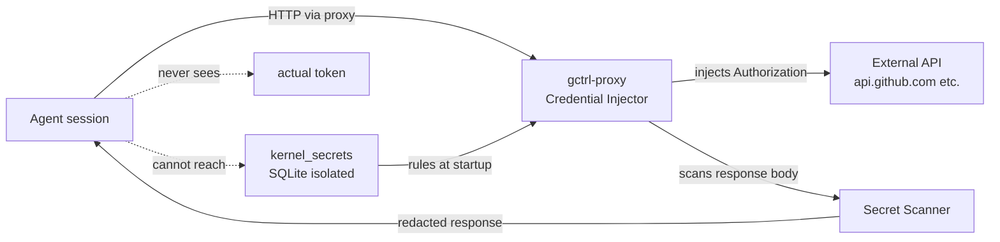

# Proxy Credential Injection

> **Design decision** — agents MUST NOT hold API secrets. The kernel proxy
> is the credential plane. Secrets live in the kernel secrets store; the
> MITM proxy injects them into outbound requests in-flight.

**Status:** design decision locked, implementation pending.
See `gctrl/ROADMAP.md` for the issue tracking implementation slices.

> **This is more than a security feature.** Credential injection is the
> enabling substrate for **agent-authored userspace tools** — the missing
> extension tier. A tool the agent wrote is untrusted code you cannot hand a
> raw token; routing its egress through this proxy (creds injected, responses
> scanned) is what makes "the agent wrote this code" compatible with "secrets
> are never exposed." See
> [extension-tiers.md](../extension-tiers.md) for the composed capability-growth
> system this unlocks.

---

## Problem

Today gctrl drivers receive secrets via environment variables (`GITHUB_TOKEN`,
`ANTHROPIC_API_KEY`, etc.) that are visible inside the agent's execution
context. A successful prompt injection attack against any agent session can
exfiltrate every secret in its environment — the agent knows the secret before
the request leaves the machine.

This is the standard weak model for agentic tooling. It is acceptable when the
agent's execution environment is fully trusted and isolated. It is not
acceptable when:

1. Agents run user-supplied or LLM-generated code (jailbreak surface).
2. Multiple agents with different authorization levels share a host.
3. An external model's output is piped directly back to the agent
   (response-poisoning surface).

Centaur's open-sourcing (May 2026) independently validated this threat model
and ships a production solution: a network-level firewall ("iron-proxy") that
intercepts agent egress and injects credentials without exposing them inside
the sandbox. Their findings: "credentials exist only inside an isolated secrets
manager, and a network-level firewall injects them into outbound requests
in-flight." LLM response bodies are scanned for leaked secrets and redacted
before the agent sees them.

gctrl already has the right primitives (`gctrl-proxy`, `hudsucker`-based MITM,
`handler.rs` in the egress path). The proxy is currently a **traffic logger**.
This spec elevates it to the **credential plane**.

---

## Design

### 1. Secrets store in the kernel

A new `kernel_secrets` SQLite table (isolated from DuckDB — never queryable via
the analytics API):

```sql
CREATE TABLE IF NOT EXISTS kernel_secrets (
    id         VARCHAR PRIMARY KEY,
    name       VARCHAR NOT NULL UNIQUE,  -- human-readable: "github", "anthropic"
    api_host   VARCHAR NOT NULL,         -- e.g. "api.github.com"
    header     VARCHAR NOT NULL DEFAULT 'Authorization',
    value      TEXT NOT NULL,            -- encrypted at rest via OS keychain or SOPS
    scope      VARCHAR NOT NULL DEFAULT 'global',  -- 'global' | 'persona:<id>'
    created_at VARCHAR NOT NULL,
    updated_at VARCHAR NOT NULL
)
```

Secrets are registered via `POST /api/secrets` (kernel-local endpoint, not
proxied to the edge — never appears in D1 sync). The kernel CLI gains:

```sh
gctrld secrets add --name github --host api.github.com --value "$GITHUB_TOKEN"
gctrld secrets list
gctrld secrets remove github
```

### 2. Proxy injection in the request path

`gctrl-proxy/handler.rs` gains a `secrets` field: `Arc<Vec<SecretRule>>` where
`SecretRule` carries `(api_host, header_name, header_value)`. At
`handle_request` time:

```
incoming request
  → match req.host against secret rules
  → if matched: inject/replace Authorization (or custom) header in-place
  → forward to upstream (agent never sees the value it sent; the proxy replaced it)
```

**Agents route external API calls through the proxy.** This is enforced at the
driver level: `driver-github`, `driver-llm`, etc. set
`HTTP_PROXY=http://127.0.0.1:<proxy_port>` in the child process's env (or
configure their HTTP client to use the proxy transport). The proxy port itself
is kernel-internal and not exposed to agents.

Drivers declare required API hosts in their crate `Cargo.toml` metadata (or a
sidecar `driver.toml`):

```toml
[package.metadata.gctrl-driver]
required_hosts = ["api.github.com"]
```

On driver load the kernel ensures at least one matching secret rule exists and
warns if not.

### 3. LLM response body scanning

The LLM relay (`relay.rs`) already sits in the response path for
`/llm/v1/chat/completions`. It gains a scanning pass before the response is
forwarded to the agent:

- Regex patterns for common secret formats: GitHub tokens (`gh[ps]_[A-Za-z0-9]{36}`),
  Anthropic keys (`sk-ant-[a-zA-Z0-9\-_]{93}`), generic `Bearer \S{20,}` tokens.
- Pattern list is configurable via `kernel_secrets` — each registered secret
  also contributes a `detect_pattern` field so the scanner knows what the
  leaked form looks like.
- On match: replace the secret value with `[REDACTED]` in the response body
  before forwarding. Log a `guardrail.secret_leak_detected` span with
  `secret.name` attribute (not the value).

This defends against the response-poisoning vector: a compromised upstream API
returning a payload that contains secrets from a previous request or from the
model's training data.

### 4. Scope isolation (future)

`scope: 'persona:<id>'` rules are only injected when the session's active
persona matches. This allows:

- A `deployer` persona to have access to production credentials.
- A `reviewer` persona to have read-only access to the same API.
- Untrusted/sandboxed sessions to have no credentials injected at all.

Scope enforcement requires the proxy to receive the active `session_id` (and
from that, the active persona). The relay already propagates
`x-session-id` headers; the MITM proxy gains the same awareness.

---

## What this does NOT do

- **Does not replace env vars for non-proxied local tools** (e.g. `git`
  running in a subprocess). Those need a separate credential isolation story
  (OS keychain credential helpers, short-lived tokens via `git credential`).
- **Does not encrypt secrets at rest today** — the `value` column stores
  plaintext in the SQLite file. Encryption via OS keychain integration or SOPS
  is a follow-up. The schema reserves space for an `encrypted` flag.
- **Does not isolate file-system access** — the proxy closes the network
  exfiltration vector; a sandboxed execution environment (see
  `vault/specs/implementation/kernel/compute-cf-containers.md`) closes the
  file-system vector.

---

## Security boundary summary



---

## Relationship to other specs

- `vault/specs/implementation/kernel/compute-cf-containers.md` — container
  isolation per session. Complementary: proxy closes network exfiltration;
  containers close file-system exfiltration.
- `vault/specs/architecture/kernel/driver-macos.md` — macOS capabilities
  bridge. Driver declarations (`required_hosts`) originate here.
- `vault/specs/principles.md` — "the kernel provides mechanisms, not policy":
  the proxy provides the injection mechanism; the `kernel_secrets` table and
  per-persona scope is policy.

---

## References

- Centaur open-source release (Paradigm / Tempo, May 2026) — production
  implementation of the credential injection + response scanning pattern.
  Architecture: iron-proxy (network firewall), isolated secrets manager.
- `gctrl-proxy/src/handler.rs` — existing `TrafficLogger`; injection hooks go here.
- `gctrl-proxy/src/relay.rs` — existing LLM relay; response scanning goes here.
- `gctrl-proxy/src/redact.rs` — existing URL query-param redaction; pattern
  extended to response body scanning.
