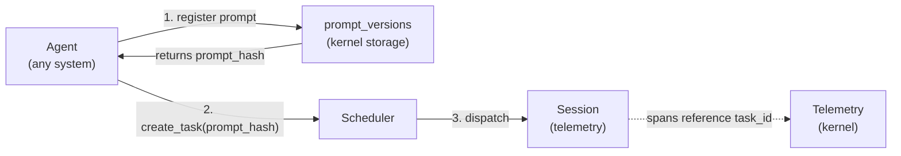
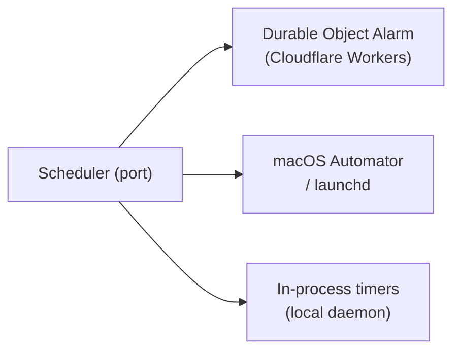

# Scheduler

The Scheduler is a kernel primitive with two responsibilities:

1. **Task tracking** — the kernel-level record of all work items created and executed by agents, normalized across agent systems (Claude Code, Claude Agent SDK, Codex, OpenCode, Aider, OpenAI, custom). The agent program is captured as `agent_kind` (the harness kind — see [harness.md](harness.md)); where it executes is captured as `compute_kind` (see [compute.md](compute.md)).
2. **Deferred and recurring execution** — scheduling Tasks to run at a point in time or on a recurring cadence.

Defined as a **kernel interface trait** with **platform-specific implementations** — the kernel defines *what* to schedule; each platform implementation decides *how*.

> **Terminology note:** "Adapter" here refers to internal kernel implementations (tokio timers, launchd, DO Alarms), not external app drivers. See [os.md § 5](../os.md) for the driver/adapter distinction.

## Implementation status (May 2026)

The unified `SchedulerPort` described below is the **target shape**. The current code splits these responsibilities across two crates:

| Responsibility | Crate | Storage |
|---|---|---|
| Task tracking (#1) — claim, dispatch, complete agent work | `gctrl-orch` | `tasks` table |
| Deferred & recurring execution (#2) — cron-driven HTTP and `exec` callbacks | `gctrl-scheduler` | `schedules` table |

`gctrl-scheduler` today is a generic "fire on cron" runner with two target kinds: `http` (POST/GET/etc. to a URL) and `exec` (spawn a subprocess) — see [§ exec Target Kind](#exec-target-kind). It does NOT yet read from or write to the `tasks` table, and it does NOT normalize agent-system metadata. The `Schedule` row in storage is a callback definition (cron + target descriptor), not a `Task`.

Unifying the two behind a single `SchedulerPort` is **deferred** — the contracts and lifecycles are different enough (long-lived agent claims with retries vs. short HTTP/exec callbacks with idempotent re-fires) that conflating them prematurely would tangle agent orchestration with periodic ingest. When unification ships, `schedule_recurring(cron)` will produce `Task` rows that the orch dispatcher claims; until then, recurring callbacks live in their own table and the two crates communicate over the kernel HTTP API.

## exec Target Kind

`gctrl-scheduler` schedule rows carry a `target_kind` discriminator. `http` is the original behaviour (fire a request via `reqwest`). `exec` spawns a subprocess via `tokio::process::Command` — letting the kernel scheduler run any registered command on cron without app-specific kernel routes. Apps that need cron-driven work (e.g. uebermensch's daily brief) register their argv via `POST /api/schedules` with `target_kind: "exec"`, instead of running their own daemon at a peer port.

This is the primitive that lets the kernel daemon stay the **single long-lived process** while still firing app-shaped jobs. Kernel never imports app code; the `command` array is opaque data, identical in character to `target_url` for `http` rows.

> **Origin:** the existing `cli_exec` HTTP route (`gctrl-otel/src/receiver.rs::cli_exec`) already spawns child processes from kernel HTTP requests for `gh`, `wrangler`, etc. The `exec` schedule kind reuses that machinery on the cron path.

### Schema additions

```text
schedules row:
  target_kind          TEXT NOT NULL DEFAULT 'http'   -- 'http' | 'exec'
  -- existing http-only fields are nullable when target_kind = 'exec'
  target_url           TEXT NULL
  target_method        TEXT NULL
  body_json            JSON NULL
  headers_json         JSON NULL
  -- new exec-only fields are nullable when target_kind = 'http'
  command              JSON NULL    -- [String]; argv. argv[0] MUST be absolute.
  cwd                  TEXT NULL    -- absolute path
  env_keys             JSON NULL    -- [String]; env var NAMES to pass through
```

`POST /api/schedules` validates mutual exclusion: `http` rows MUST set `target_url`; `exec` rows MUST set `command + cwd + env_keys`; rejecting both/neither with 400.

### Runner mechanics

For `target_kind = exec`, the runner (and `POST /api/schedules/{id}/run`):

1. Builds `tokio::process::Command::new(argv[0]).args(&argv[1..])`. Reuses the spawn-and-timeout pattern from `gctrl-orch/src/agent.rs:41-78`.
2. **Filters env at spawn time** — iterates `std::env::vars()` and passes through only names listed in `env_keys`. The daemon's other env vars (e.g. unrelated tokens) MUST NOT leak into the child.
3. Sets `process_group(0)` so a timeout-induced SIGKILL also reaps grandchild processes.
4. Streams stdout with `take(RESPONSE_BODY_CAP_BYTES)` — does NOT use `wait_with_output` (unbounded buffering would OOM on a chatty child).
5. Wraps the wait in `tokio::time::timeout(Duration::from_secs(timeout_secs), ...)`. Timeout = killed child = `success: false`, `last_error: "timed out after {N}s"`.
6. Records: `last_status` ⇐ exit code (raw `i64`, not HTTP-status-shaped), `last_response` ⇐ truncated stdout, `last_error` ⇐ truncated + redacted stderr (see § Output Redaction).

Both the runner fiber and the `run_now` HTTP handler MUST branch on `target_kind` before dispatching. A handler that calls `reqwest` on an `exec` row is a silent bug (the URL field is null).

### Security gates (operator opt-in)

`exec` is **disabled by default** and gated behind config that the daemon operator must opt into. Adding `target_kind=exec` rows to `schedules` without this config is rejected at `POST /api/schedules` with 400:

```toml
# ~/.config/gctrl/config.toml  (read at daemon start)
[scheduler]
exec_enabled = true
exec_allowed_programs = [
  "/Users/<me>/.nvm/versions/node/v20/bin/node",
  "/usr/local/bin/uv",
]
```

| Gate | What it stops |
|------|---------------|
| `exec_enabled: bool` (default `false`) | Accidental enablement. With this flag off, `POST /api/schedules` with `target_kind=exec` returns 400. |
| `exec_allowed_programs: [PathBuf]` (default `[]`) | Arbitrary-binary execution. `argv[0]` MUST appear verbatim in this list, else create returns 400 and runner refuses to spawn. |
| Absolute `argv[0]` requirement | `PATH` injection: with `cwd: /tmp/attacker`, a relative `argv[0]: "node"` would resolve via `PATH` and run a planted binary. Reject anything not starting with `/`. |
| `Host` header allowlist on the kernel router (`localhost`, `127.0.0.1`, `[::1]`) | DNS rebinding: a browser tab that rebinds a public hostname to `127.0.0.1` would otherwise reach `:4318` from a sandboxed origin. The check applies to all kernel routes; `exec` makes it a hard prerequisite. |

The `exec` writeup in this section assumes those gates are in place. Operators running with `exec_enabled = false` see no behavioural change; existing `http` schedules keep working.

### env_keys vs env_vars

The schedule row stores env var **names**, not values. Values come from the daemon's process environment at spawn time. Trade-off:

- **Pro:** schedule rows are not secret-bearing; `GET /api/schedules` is safe to read. Rotating `TELEGRAM_BOT_TOKEN` does not require touching schedule rows.
- **Con:** all `exec` schedules with the same `env_keys` see the same daemon-env value. There is no per-schedule scoping below the daemon's own env. Acceptable for a single-user, local-first daemon; revisit if multi-tenant ever ships.

The daemon's own env stays the single secret store. Bootstrapping is operator-owned — the gctrl macOS app launches the bundled `gctrld` sidecar (registered as a Login Item; see `apps/gctrl-desktop/src/main/login-item.ts`), and the operator's shell env (e.g. `~/.zshenv`, `direnv`) supplies driver secrets to that process. CLI users running `gctrld serve` directly inherit env from their shell as usual.

### Output Redaction

`last_response` and `last_error` are queryable via `GET /api/schedules` and `GET /api/schedules/{id}`. To bound the leak surface from a misbehaving child that echoes a secret on stderr:

1. Truncate `last_error` to a small cap (256–512 bytes). Long stderr goes to `tracing::warn!` and the OTel span, not the DB row.
2. Apply a redaction regex to stderr before writing the column. Pattern matches common credential shapes: `(?i)(token|secret|key|password|webhook)\s*[=:]\s*\S+` → replace value half with `[redacted]`.

Redaction is best-effort defence-in-depth, not a primary control. The primary control is: don't echo secrets on child stderr.

### Observability

Each fire emits a `scheduler.exec` span with attributes:

| Attribute | Source |
|-----------|--------|
| `schedule.name` | row |
| `schedule.id` | row |
| `command_hash` | SHA-256 of `argv` joined with `\0`; identifies the exact command without exposing it in attribute values |
| `cwd` | row |
| `exit_code` | child exit (or `null` on spawn failure) |
| `stdout_bytes` | bytes captured (post-cap) |
| `stderr_bytes` | bytes captured (post-cap) |
| `duration_ms` | end-to-end fire-to-record |
| `timed_out` | bool |

Existing `tracing::info!` log lines on the runner stay; the new span supplements them and gives `gctrl analytics` a queryable surface.

### Tests

Required coverage when introducing the kind (none of these exist today):

| Test | File |
|------|------|
| Runner fires exec, records exit 0 | `gctrl-scheduler/tests/runner_dispatch.rs` |
| Runner records non-zero exit as `success: false` | same |
| Runner kills child on timeout, records error | same |
| Runner does NOT leak `TELEGRAM_BOT_TOKEN` when `env_keys: ["UBER_VAULT_DIR"]` | same — the env-leak invariant |
| `POST /api/schedules` with `target_kind=exec` rejects when `exec_enabled=false` | `gctrl-scheduler/tests/http_routes.rs` |
| `POST /api/schedules` with `target_kind=exec` rejects relative `argv[0]` | same |
| `POST /api/schedules` with `target_kind=exec` rejects `argv[0]` outside `exec_allowed_programs` | same |
| `POST /api/schedules/{id}/run` branches on `target_kind` (exec rows do NOT call `reqwest`) | same |
| Schema migration adds the new columns nullable | `gctrl-storage` migration test |
| `Schedule` round-trips through `serde` for both kinds | `gctrl-core/src/schedule.rs` unit test |

---

## Tasks

A **Task** is the kernel's unit of agent work. Every agent — regardless of system (Claude Code, Claude Agent SDK, Codex, OpenCode, Aider, OpenAI API, custom) — creates Tasks through the Scheduler. The kernel tracks them uniformly.

### Why kernel-level?

Different agent systems have incompatible internal representations of work. The kernel normalizes them:

| Agent System | How work is represented internally | Kernel normalization |
|---|---|---|
| Claude Code | WORKFLOW.md prompt template + conversation | `Task` row with `prompt_hash`, `agent_kind = claude-code` |
| Claude Agent SDK | SDK event log | `Task` row with `prompt_hash`, `agent_kind = claude-agent-sdk` |
| Codex (OpenAI) | Instructions + file context | `Task` row with `prompt_hash`, `agent_kind = codex` |
| OpenCode | SQLite Drizzle session rows | `Task` row with `prompt_hash`, `agent_kind = opencode` |
| Aider | Commit message + diff context | `Task` row with `prompt_hash`, `agent_kind = aider` |
| OpenAI API direct | System prompt + messages | `Task` row with `prompt_hash`, `agent_kind = openai` |
| Custom | Arbitrary | `Task` row with `prompt_hash`, `agent_kind = custom` |

By routing all agent work through the Scheduler, gctrl gets a single queryable record of what every agent did, what prompt drove it, and what session it ran in — regardless of the agent system used.

For the per-harness architectural details (process model, sandbox, IPC, OTel) consumed by these importers, see [harness.md](harness.md) and [`../../references/agent_orchestration.md`](../../references/agent_orchestration.md).

### Task Domain Type

See [domain-model.md § 2 Task](../domain-model.md#task-specs-only) for `TaskId` and `Task` struct. `TaskStatus` (`Pending` | `Running` | `Paused` | `Done` | `Failed` | `Cancelled`), `AgentKind` (`ClaudeCode` | `ClaudeAgentSdk` | `Codex` | `OpenCode` | `Aider` | `OpenAI` | `Custom`), and `ActorKind` (`Human` | `Agent`) are defined there.

The companion `ComputeKind` (`LocalProcess` | `CfContainers` | `E2b` | `SshRemote` | `Docker` | `BrowserTab`) lives alongside `AgentKind` — see [compute.md](compute.md). Tasks carry both: `agent_kind` identifies the runtime; `compute_kind` identifies where it ran. The pair, not either alone, fully identifies a dispatch.

### Context Field — Agent-System Metadata

The `context` JSON field stores agent-system-specific metadata, normalized at task creation time. It MAY carry a `compute` block describing the target ComputeSubstrate (see [compute.md § Configuration](compute.md#configuration)); when omitted, the orchestrator defaults to `local-process`.

```json
// claude-code on local-process
{ "model": "claude-sonnet-4-6", "workflow_file": "WORKFLOW.md", "persona": "reviewer-bot",
  "compute": { "kind": "local-process" } }

// claude-code on cf-containers
{ "model": "claude-sonnet-4-6", "persona": "reviewer-bot",
  "compute": { "kind": "cf-containers", "image": "gctrl/claude-code:latest", "memory_mb": 2048 } }

// codex on cf-containers
{ "model": "o1", "temperature": 1.0,
  "compute": { "kind": "cf-containers", "image": "gctrl/codex:latest" } }

// opencode on cf-containers (no inner sandbox — outer compute IS the boundary)
{ "model": "claude-sonnet-4-6", "persona": "explorer",
  "compute": { "kind": "cf-containers", "image": "gctrl/opencode:latest" } }

// aider on local-process (trusted Task only — see compatibility matrix)
{ "model": "gpt-4o", "auto_commits": true,
  "compute": { "kind": "local-process" } }

// custom
{ "executable": "/path/to/agent", "args": ["--prompt-file", "task.md"],
  "compute": { "kind": "local-process" } }
```

Applications (gctrl-board) MAY read `context` for display purposes but MUST NOT write to it.

---

## Scheduler Port

The Scheduler exposes a unified port for task management and scheduling. All agent systems that create Tasks MUST go through this interface.

See [domain-model.md § 3 SchedulerPort](../domain-model.md#schedulerport-specs-only) for the full `SchedulerPort` trait and `CreateTaskInput` type.

The port covers three responsibility groups:

1. **Task management** — create / status / complete / fail / cancel / get / list, and `link_session` for binding a Task to its executing Session.
2. **Dependency graph** — `add_dependency` / `remove_dependency` (acyclicity enforced), `list_ready` for the dispatcher to poll.
3. **Deferred & recurring scheduling** — `schedule_once(at)`, `schedule_recurring(cron)`, `cancel_schedule`.

---

## Prompt Tracking

Every Task MAY reference a `prompt_hash` — the hash of the rendered prompt stored in `prompt_versions`. This gives a full audit trail of *what was asked* for every task, across all agent systems.



The `prompt_versions` table (see [domain-model.md](../domain-model.md) § 5.3) stores the rendered prompt content. Tasks reference it by hash — the same prompt used by multiple tasks is stored once.

---

## Storage

The Scheduler owns the `tasks` table (see [domain-model.md](../domain-model.md) § 5.1 for full DDL). Key design choices:

1. Dependency edges stored inline as JSON arrays (`blocked_by`, `blocking`) — avoids a separate edge table; `WHERE json_array_length(blocked_by) = 0` gives the ready set efficiently.
2. `context` is untyped JSON — agent-system-specific metadata doesn't belong in typed columns.
3. `prompt_hash` is nullable — not all tasks have a pre-registered prompt (e.g., continuation tasks).

---

## Platform Adapters



| Platform | Adapter | Durable? |
|----------|---------|----------|
| **Cloudflare Workers** | Durable Object Alarm | Yes — persists across restarts |
| **macOS** | launchd / Automator | Yes — OS-managed scheduling |
| **Local daemon** | In-process timers | No — lost on daemon restart |

---

## Design Constraints

1. The scheduler port lives in the domain — no platform dependencies.
2. Platform adapters live behind feature flags or in separate modules.
3. The in-process adapter is the default and requires no external setup.
4. Task payloads are serializable — they describe *what* to run, not *how*.
5. Durable adapters persist schedules across restarts. The in-process adapter does not — applications MUST handle re-registration on startup if durability is needed.
6. Only agents create and mutate Tasks through the Scheduler port. Human-facing interfaces (CLI `gctrl board`, HTTP `/api/board/*`) expose Tasks as read-only.
7. Every agent system MUST create Tasks via `SchedulerPort.create_task` — MUST NOT write to the `tasks` table directly.
8. The Scheduler MUST emit kernel IPC events on every Task state transition so applications (gctrl-board) can react.
