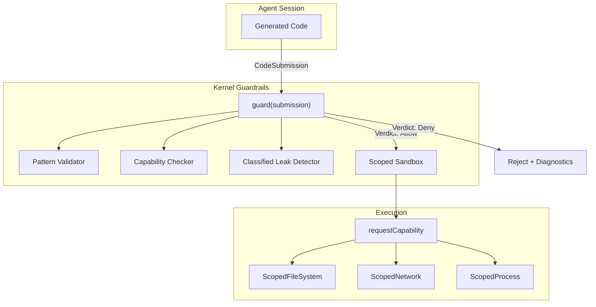

# TACIT — Tracked Agent Capabilities In Types

Kernel-level guardrails for agent-generated code. Prevents capability leakage, classified data exfiltration, and unsafe operations before code executes — not after.

> Inspired by: [Tracking Capabilities for Safer Agents](https://arxiv.org/abs/2603.00991) (Odersky et al., EPFL, 2025). Reimplemented in TypeScript without Scala's capture checking — enforced via static analysis + runtime scoping rather than compiler-level type tracking.

> Status: **[initial]**. Core engine implemented. MCP server optional.

---

## 1. Design Principles

1. **Kernel-level, not app-level.** TACIT is a kernel primitive under Guardrails. Apps and agents call it; they don't own it.
2. **Static-first, runtime-second.** The `guard()` function rejects code before execution. Runtime scoping (`requestCapability`) is the second line for code that passes validation.
3. **MCP is optional.** The library works as a direct import (`import { guard } from "gctrl-tacit"`). The MCP server is an adapter that exposes the same functionality as tools — for agents that prefer tool-calling over code-mode.
4. **No Scala dependency.** The original paper uses Scala 3's capture checking for compile-time guarantees. We achieve equivalent safety via pattern validation + capability scoping + information-flow tracking in TypeScript.

---

## 2. Three Safety Properties

Following the paper's taxonomy:

| Property | Scala 3 (original) | TypeScript (gctrl) |
|----------|--------------------|--------------------|
| **Capability Safety** — capabilities cannot be forged | Capture checking: types track which capabilities a value retains | `requestCapability()` scope — capability is revoked on scope exit; runtime `assertNotRevoked` check |
| **Capability Completeness** — all effects go through capabilities | `language.experimental.safe` blocks unchecked operations | Pattern validator blocks direct I/O, eval, imports; capability checker finds ungated operations |
| **Local Purity** — `Classified.map()` accepts only pure functions | Capture set `{}` (empty) on closure type → compiler rejects impure closures | Runtime: `Classified.map()` receives a function. Static: leak detector traces dataflow from classified bindings to output channels |

---

## 3. Architecture



---

## 4. Core API

### 4.1 `guard(submission, options?) → GuardResult`

The main entry point. Validates code statically without executing it.

```typescript
interface CodeSubmission {
  code: string;
  language: "typescript" | "javascript";
  sessionId: string;
  capabilities: CapabilityGrant[];  // what this code is allowed to do
}

interface GuardResult {
  verdict: Verdict;                    // Allow | Deny | Warn
  classifiedLeaks: ClassifiedLeak[];   // exfiltration attempts
  capabilityViolations: CapabilityViolation[];  // ungated operations
  validationErrors: Violation[];       // forbidden patterns
}
```

### 4.2 `Classified<T>`

Information-flow wrapper. Once classified, data can only be transformed via `.map()` (pure function) or revealed with explicit permission.

```typescript
const secret = classify("api-key-123");
secret.toString();          // "Classified(****)"
secret.map(s => s.length);  // Classified<number>
reveal(secret, permission); // "api-key-123" — requires RevealPermission
```

### 4.3 `requestCapability(kind, scope, operation)`

Scoped capability grant. The capability is valid only within `operation` — it is revoked when the callback returns (or throws).

```typescript
requestCapability("filesystem", { root: "/data", readonly: true }, (fs) => {
  // fs is valid here
  const content = fs.read("config.json");
  return content;
});
// fs is revoked here — any retained reference will throw CapabilityRevokedError
```

---

## 5. Integration with Existing Guardrails

The Rust `gctrl-guardrails` crate handles runtime policy (cost caps, loop detection, command blocklist). TACIT handles **code-level** safety:

| Layer | What it guards | When it runs |
|-------|---------------|--------------|
| `gctrl-guardrails` (Rust) | Session cost, loop detection, command blocklist, diff size | Per-span, during execution |
| `gctrl-tacit` (TypeScript) | Capability boundaries, information flow, forbidden patterns | Pre-execution, on code submission |

Both are kernel primitives. They compose: the orchestrator calls `guard()` before launching code, and the Rust engine monitors the session during execution.

---

## 6. MCP Server (Optional)

When exposed as an MCP server, agents can call guardrails as tools:

| Tool | Purpose |
|------|---------|
| `tacit_guard` | Validate code before execution |
| `tacit_check_capabilities` | Pre-flight: what capabilities does this code need? |
| `tacit_classify` | Mark a value as classified (for audit trail) |

The MCP server is a thin adapter over the same `guard()` function. It's useful when:
- The agent runs in a separate process (CF Container, e2b) and needs to validate code remotely
- The agent uses tool-calling style rather than code-mode
- External agents (not running through gctrl's orchestrator) want guardrail checks

---

## 7. Validation Pipeline (4 Phases)

### Phase 1: Pattern Validation (fast, no parsing)

Regex-based blocklist of forbidden operations. Strips string literals and comments first to prevent evasion via embedding patterns in strings.

Blocked categories: direct I/O (`fs.*`, `child_process`, `net.*`), eval/dynamic code, global access (`process.env`, `globalThis`), prototype pollution, Proxy.

### Phase 2: Capability Checking

Maps operations in the code to required capabilities. If the code uses `readFile` but wasn't granted `filesystem`, it's a violation.

### Phase 3: Classified Leak Detection

Traces dataflow from `classify()` bindings through variable assignments. Flags any path where classified data reaches an output channel (stdout, network, filesystem, return value) without going through `.map()`.

### Phase 4: Custom Patterns (user-defined)

WORKFLOW.md can define additional forbidden patterns per-project.

---

## 8. Dual Output Channels

Following the paper's architecture, sandboxed code has two output paths:

- **Agent-visible output** — what gets fed back to the LLM. `Classified` values render as `"Classified(****)"`.
- **Secure output** — delivered only to the human user (via desktop SSE, terminal). Shows actual classified content.

This prevents classified data from ever entering the LLM's context window, even if the agent's code touches it.

---

## 9. Non-Goals

1. **No compile-time capture checking.** TypeScript's type system cannot track which closures retain which capabilities. We enforce at runtime + static analysis instead.
2. **No custom language.** Agents write TypeScript/JavaScript, not a DSL. The validator constrains what subset is allowed.
3. **No sandboxing of the validator itself.** The `guard()` function runs in the kernel's trust boundary. Only the *validated code* runs in a sandbox.
4. **No formal verification.** Unlike the Rust guardrails (Lean-verified state machine), TACIT relies on empirical testing. The pattern list is a heuristic, not a proof.
