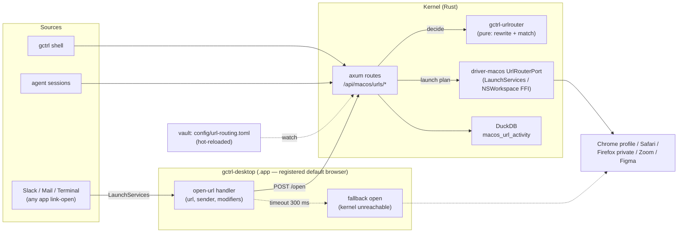

# URL Routing — System-Wide Link Router

gctrl becomes the macOS **default web browser** — not to render pages, but to decide, per link, which real browser (or native app) opens it. Every `http(s)` URL opened outside a browser — from Slack, Mail, Terminal, a PDF, an agent session — is intercepted, rewritten (trackers stripped, redirectors unwrapped), matched against a declarative ruleset in the vault, and launched into the right target: a specific browser, a specific profile, a private window, or a native app (Zoom, Figma, Spotify).

This is the same absorb-the-menu-bar-utility motion as the prevent-sleep `PowerPort` ([driver-macos.md](driver-macos.md)): a single-purpose utility class replaced by a kernel capability that every gctrl surface — desktop tray, shell, board, agents — consumes through one HTTP contract, with telemetry and vault-resident config for free.

Architecture only; FFI bindings, `Info.plist` keys, and crate wiring land in `implementation/kernel/url-routing.md` alongside the implementation.

## User stories

- *Work links stay in the work profile.* `github.com/acme-corp/*` and `*.atlassian.net` open in Chrome profile "Work"; everything else in Safari. No more pasting links between browsers.
- *Meeting links skip the browser.* `*.zoom.us/j/*` opens the Zoom app directly.
- *Links from Slack open clean.* `utm_*`/`fbclid` stripped, Outlook SafeLinks and Google redirect wrappers unwrapped before the browser ever sees the URL.
- *Agents obey the same rules.* A session that opens a PR link routes it through the kernel — same ruleset, same telemetry — instead of shelling out to `open` and landing in whatever the OS default is.

## Why kernel + desktop split

The routing brain cannot live in the Electron app alone, and the kernel alone cannot be the registered handler:

1. **LaunchServices requires an `.app` bundle.** Only a GUI app with `CFBundleURLTypes` for `http`/`https` can be selected as default browser. The headless `gctrld` binary is ineligible — so **gctrl-desktop is the registered handler**, nothing more. It receives the open-URL Apple Event and forwards `{url, source_app, modifiers}` to the kernel. This stays within the desktop app's "thin packaging layer" charter ([gctrl-desktop.md](../apps/gctrl-desktop.md)): no routing logic, no new `/api/desktop/*` surface.
2. **The decision and the launch belong to the kernel.** Rule evaluation, rewriting, ruleset validation, activity logging, and the launch live behind the kernel's `/api/macos/urls/*` routes — evaluation in a pure engine crate, the launch in `driver-macos` — for the reasons that put Spaces there: one contract for all consumers (tray, shell, agents, scheduler), OTel spans and caching from the kernel middleware, and the invariant that the driver is the only crate linking Apple frameworks.
3. **The rule engine itself is OS-neutral.** It ships as a new pure crate `kernel/crates/gctrl-urlrouter` (no FFI, no Apple deps) so a future `driver-linux` (`xdg-settings`) or `driver-windows` (registry `UrlAssociations`) reuses it unchanged. `driver-macos` depending on a shared pure crate is fine under [driver rule #6](../os.md#driver-rules) — the ban is on drivers importing *each other*.

## Architectural position



**Loop hazard, pinned here:** every launch targets an **explicit application**. Nothing in the pipeline may open a URL via the system default handler — that handler is us, and the open would re-enter. Ruleset validation rejects any target equal to gctrl's own bundle id; the desktop fallback launches the fallback browser by bundle id, never `shell.openExternal`.

## Kernel interface

`PlatformPort` ([driver-macos.md](driver-macos.md)) gains one capability sub-trait:

```rust
// gctrl-core/src/platform.rs   (sketch)
fn urls(&self) -> Option<&dyn UrlRouterPort>;

pub trait UrlRouterPort: Send + Sync {
    fn status(&self) -> UrlRouterStatus;          // default-handler state, ruleset health
    fn installed_targets(&self) -> Result<Vec<Target>, PlatformError>;
    fn open(&self, plan: &RoutePlan) -> Result<(), PlatformError>;
    fn prompt_default_handler(&self) -> Result<HandlerStatus, PlatformError>;
}
```

Routing is **not** on the port — `gctrl-urlrouter::route(request, ruleset) -> RoutePlan` is a pure function, unit-tested without any platform. The driver contributes only what needs FFI: target discovery (`NSWorkspace.urlsForApplications(toOpen:)` plus Chrome `Local State` / Firefox `profiles.ini` profile enumeration), the launch, and default-handler registration (`NSWorkspace.setDefaultApplication(at:toOpenURLsWithScheme:)`, which macOS gates behind its own user-consent dialog).

**Launch strategy.** `NSWorkspace.OpenConfiguration.arguments` is ignored when the target app is already running — the common case — so profile and private flags passed that way would silently drop. Browser targets carrying flags therefore launch a **new process instance** (`createsNewApplicationInstance`, or exec of the bundle binary) and rely on the browser's own single-instance forwarding: Chromium's process singleton hands the fresh command line (URL + `--profile-directory` / `--incognito`) to the running instance; Firefox does the equivalent via per-profile remoting (`-P` / `-private-window`). Flag-free targets use plain `open(urls:withApplicationAt:)`. Per-family quirks are an implementation-spec matter.

```rust
pub struct RouteRequest {
    pub url: Url,
    pub source_app: Option<BundleId>,   // sender of the open-URL Apple Event
    pub modifiers: Modifiers,           // held at open time; may be Unknown
    pub trigger: Trigger,               // LinkOpen | Cli | Agent
}

pub struct RoutePlan {
    pub final_url: Url,                 // after rewrites
    pub target: Target,                 // Browser { bundle, profile?, private } | App { bundle }
    pub background: bool,               // launch without stealing focus
    pub matched_rule: Option<RuleName>, // None = defaults applied
    pub rewrites: Vec<RewriteName>,
}
```

`source_app` and `modifiers` are read by the desktop handler from the Apple Event (sender attribute) and `NSEvent.modifierFlags`. Electron does not expose either, so the handler needs a small native addon; until it lands, the handler sends `source_app: None` / `modifiers: Unknown` and `/api/macos/urls/health` advertises the degradation so rules using those matchers are diagnosed as inert rather than silently never matching. Exact mechanism (addon vs. frontmost-app heuristic) is an implementation-spec decision.

## Routing pipeline

`normalize → rewrite → match → plan`, fully deterministic:

1. **Normalize.** Parse; reject non-`http(s)` schemes (422 at the route; other schemes are out of scope v1).
2. **Rewrite chain.** Rewrites apply in file order, each at most once per pass, chain capped at 10 passes. Kinds: `strip-params` (explicit list or the built-in tracker set: `utm_*`, `fbclid`, `gclid`, `mc_eid`, …), `unwrap-param` (extract an embedded URL from a redirector query param — SafeLinks, Google/Slack redirects), `replace` (regex with capture groups), `upgrade-https`. **Every pass's output must remain an absolute `http(s)` URL** — a rewrite whose output parses to any other scheme (including a user-authored `replace` regex, which syncs in from other machines via the vault) is discarded and the pre-rewrite URL kept, closing the `javascript:`/`file:` injection hole. **The router never issues a network request** — unwrapping is pattern extraction, not fetching; shortener expansion is explicitly out of scope.
3. **Match.** First matching rule in file order wins. Matchers (AND within a rule): URL glob on `host/path` (`*.zoom.us/j/*`), opt-in full regex, `source-app`, `modifiers` (matches when every listed key is held), `trigger`. Globs exclude the query string — query-sensitive rules use the regex matcher — and `*` matches any run of characters including empty, so `*.safelinks.protection.outlook.com/*` matches the bare-path SafeLinks form. Matching runs against the **rewritten** URL.
4. **Plan.** The rule's target, or `[defaults]` when nothing matches. Private-window support varies per browser (Chromium `--incognito`, Firefox `-private-window`; Safari has no equivalent) — validation flags `private = true` on targets that can't honor it.

## Ruleset — vault-resident, declarative

The ruleset is one TOML file in a kernel-owned vault mount — proposed `config/url-routing.toml` at the vault root; how that mount registers in the per-project vault registry ([sync.md](sync.md) keys sync on registered project mounts) is settled in the implementation spec. It is Obsidian-visible, follows the vault wherever it syncs, and hot-reloads via the existing vault watch pipeline. Non-developers edit rules the same way they edit board files; no rebuild, no restart.

```toml
[defaults]
browser = "com.apple.Safari"
strip-trackers = true                     # built-in tracker-param set

[[rewrite]]
name = "outlook-safelinks"
match = "*.safelinks.protection.outlook.com/*"
unwrap-param = "url"

[[rule]]
name = "work"
match = ["github.com/acme-corp/*", "*.atlassian.net/*"]
browser = { bundle = "com.google.Chrome", profile = "Work" }

[[rule]]
name = "meetings"
match = ["*.zoom.us/j/*"]
app = "us.zoom.xos"

[[rule]]
name = "slack-private"
source-app = "com.tinyspeck.slackmacgap"
match = ["*"]
browser = { bundle = "com.google.Chrome", private = true }

[[rule]]
name = "peek"                             # hold option to force the alternate browser
modifiers = ["opt"]
match = ["*"]
browser = "org.mozilla.firefox"           # string form = bundle id, no flags
```

Deliberately **declarative, not scriptable** — see Alternatives. Validation runs on every reload: unknown keys, bad globs/regexes, targets not among `installed_targets()`, self-targeting, and inert matchers all surface as diagnostics in `/api/macos/urls/health` and `gctrl macos urls status`. A ruleset that fails to parse fail-safes to `[defaults]` (links must never stop opening) and raises one notification per file change. Because the file syncs across machines via the vault while installed browsers differ per machine, a missing target is a per-machine advisory (that rule falls through to defaults locally), not a fatal error.

## HTTP API

```
GET  /api/macos/urls/health            → { supported, is_default_handler, capabilities: [source_app, modifiers], ruleset: { valid, version, diagnostics[] } }
POST /api/macos/urls/route             { url, source_app?, modifiers?, trigger? } → RoutePlan            (decide only — dry run)
POST /api/macos/urls/open              { url, source_app?, modifiers?, trigger? } → RoutePlan            (decide + launch)
GET  /api/macos/urls/rules             → parsed ruleset + diagnostics
GET  /api/macos/urls/targets           → installed browsers/apps + discovered profiles
POST /api/macos/urls/enabled           { enabled: bool } → UrlRouterStatus                          (kernel state — see tray toggle)
POST /api/macos/urls/default-handler/prompt → triggers the macOS default-browser consent dialog
```

`urls` joins the driver-wide capability set in `GET /api/macos/health`; the per-capability `GET /api/macos/urls/health` carries the detail. `/route` vs `/open` split keeps the dry-run tester and acceptance tests side-effect-free. `/targets` is cached with a short TTL (app installs are rare); `/open` and `/route` are never cached. `/open` is side-effecting on the loopback API: it follows the kernel-wide local-auth stance and additionally rejects browser-originated requests (Origin/Host validation), so a hostile web page cannot form-POST arbitrary launches. Consistent with the driver-wide rule, registration is **never** attempted at kernel or desktop startup — `default-handler/prompt` fires only from a user action (tray or settings CTA), mirroring the no-prompts-at-boot policy in [driver-macos.md](driver-macos.md).

Shell surface (options before positionals, per `@effect/cli`):

```sh
gctrl macos urls test --source com.tinyspeck.slackmacgap "https://example.com/x?utm_source=y"
gctrl macos urls status
gctrl macos urls open "https://github.com/acme-corp/gctrl/pull/1"
```

`test` prints applied rewrites, matched rule, and the plan without launching — the answer to "why did that link open there?".

## Desktop integration

- `Info.plist` declares `CFBundleURLTypes` for `http` + `https` (role `Viewer`) **and** `CFBundleDocumentTypes` for `public.html` — LaunchServices lists an app in the default-browser picker only when it handles both the schemes and HTML documents (verified with a probe build during implementation). Consequence: gctrl-desktop also receives double-clicked `.html` files; v1 forwards `file:` document opens straight to the fallback browser, unrouted.
- The open-URL handler POSTs to `/api/macos/urls/open` with a **300 ms deadline**. On timeout or kernel-down it launches the fallback browser by bundle id — a click on a link is never held hostage by a slow or absent kernel. The fallback is `[defaults].browser` cached from the last successful kernel contact; on a cold cache (first run, kernel never reached) the last resort is Safari. Same fallback shape as the tray's `powerSaveBlocker` degradation for prevent-sleep.
- Tray gains a "Link routing" section: on/off toggle (kernel state via `POST /api/macos/urls/enabled` — disabled routes **every** trigger, including CLI and agent opens, to `[defaults]`, so what the tray shows is what all consumers get), handler status ("gctrl is/isn't the default browser" with the prompt CTA), and "Open ruleset" (reveals the TOML in the vault).
- [gctrl-desktop.md](../apps/gctrl-desktop.md)'s main-process responsibilities list gains the open-URL forwarder (and its fallback deadline) when this lands — today that list covers only `gctrl://` deep links.
- Cold start: if the user quit gctrl-desktop, LaunchServices boots the `.app` on the first link click (~1–3 s Electron cold start). Accepted tradeoff — the app is a login-item-resident tray app by default, so the warm path is the norm.

## Latency budget

Warm path (desktop resident, kernel up): loopback HTTP + pure rule eval is single-digit ms; the `NSWorkspace` launch dominates. Budget: **≤ 50 ms added p95** between Apple Event receipt and launch call, enforced by a latency histogram on the `/open` span so regressions show up in analytics rather than as vibes.

## Storage

```sql
CREATE TABLE macos_url_activity (
  ts            TIMESTAMP NOT NULL DEFAULT now(),
  machine_id    TEXT NOT NULL,
  host          TEXT NOT NULL,            -- eTLD+1 only, never path/query
  source_app    TEXT,
  trigger       TEXT NOT NULL,            -- 'link_open' | 'cli' | 'agent'
  rule_name     TEXT,                     -- NULL = defaults
  target_bundle TEXT NOT NULL,
  rewrites      INTEGER NOT NULL DEFAULT 0,
  latency_ms    INTEGER
);
```

Host-only by default; a `full_url` column populates only under an explicit `activity = "full"` opt-in in the ruleset `[defaults]`. Table follows the `{driver}_*` naming convention and is **local-only, never synced** — browsing activity never leaves the machine, the same machine-local stance [driver-macos.md](driver-macos.md) takes for Space labels; the concrete exclusion mechanism is defined with the sync implementation ([sync.md](sync.md)).

## Telemetry & privacy

- One OTel span per `/open` (`driver.macos.urls.open`) with `rule_name`, `target_bundle`, `latency_ms`, `host`.
- **Full URLs never appear at INFO.** Host at INFO, full URL only in DEBUG spans behind the existing `gctrl-otel` redaction rules — stricter than Space labels, since URLs carry auth tokens and document ids.
- Becoming the default browser makes gctrl a chokepoint for the user's entire link traffic. The activity table's host-only default, local-only storage, and the no-network-requests rule in the rewrite engine are the three commitments that make that position acceptable; each is asserted by tests, not just documented.

## Failure modes

| Symptom | Behavior | Surfaced as |
|---|---|---|
| Kernel unreachable / >300 ms | Desktop opens fallback browser directly | Tray badge "routing degraded"; gap in activity log |
| User reverts default browser in System Settings | Routing dormant; nothing intercepted | `is_default_handler: false` in `urls/health`; tray CTA |
| Ruleset parse/validation error | Fail-safe to `[defaults]` | Diagnostics in `urls/health` + one notification per change |
| Rule targets uninstalled browser | Rule falls through to defaults on this machine | Per-machine advisory diagnostic |
| Rewrite chain exceeds 10 passes | Stop, use last URL | WARN span `rewrite_loop=true` |
| Any rewrite output not absolute `http(s)` | Rewrite discarded, pre-rewrite URL kept | WARN span |
| Target launch fails at open time (app deleted since reload, `NSWorkspace` error) | Retry once with the `[defaults]` target | WARN span `launch_fallback=true` |
| Non-`http(s)` scheme posted to `/route` or `/open` | 422 | — |
| `source_app`/`modifiers` unavailable (no native addon) | Matchers using them diagnosed inert | `capabilities` omits them in `urls/health` |

## Alternatives considered and rejected

| Approach | Why rejected |
|---|---|
| **Scriptable config** (user-supplied JS/TS evaluated on every open) | Arbitrary code running on every link click is an attack surface and can't be statically validated; it also walls off non-developer editing, against the vault-first principle. The declarative matcher/rewrite set covers the observed uses; if it ever proves insufficient, the escape hatch is a sandboxed CEL-style expression matcher — not embedded JS. |
| **Standalone minimal handler app** (tiny native `.app` that routes on its own) | A second signed bundle with its own update channel and its own config, invisible to kernel telemetry. gctrl-desktop is already resident, signed, and auto-updated; the kernel already owns config, storage, and spans. |
| **Browser extension** | Sees only clicks inside a browser that's already open — the feature's whole point is intercepting opens from *other* apps. |
| **`gctrld` as registered handler** | LaunchServices requires a GUI `.app` bundle; the kernel is headless by design. |

## Testing

| Layer | Where | What |
|---|---|---|
| Unit | `gctrl-urlrouter/src/**` | Rule engine: glob/regex matchers, rewrite chain + cap, tracker set, unwrap validation, TOML diagnostics, first-match ordering. No FFI, runs on every platform. |
| Unit | `gctrl-driver-macos/src/urls/**` | Plan→launch mapping (new-instance vs. plain open, profile/private flag construction, background), self-target rejection. |
| Integration | `gctrl-driver-macos/tests/urls_smoke.rs` | Real `NSWorkspace.urlsForApplications(toOpen:)` + profile discovery on a developer Mac; gated on `--features integration-macos`, skipped in CI. |
| Acceptance | `apps/gctrl-desktop/tests/acceptance/macos-urls.spec.ts` | Packaged `.app`: `urls/health` reports handler status; `/route` dry-run round-trips a fixture ruleset. No actual browser launches. |
| Manual QA | recipe in the implementation spec | Set default browser, click links in Slack/Mail/Terminal, verify profile/private/app targets, verify fallback with kernel stopped. |

## Out of scope (v1)

- **`mailto:` and custom schemes.** Same pipeline, separate handler declarations; planned follow-up.
- **Shortener expansion** (`bit.ly` → destination) — requires network fetches, which the router categorically does not make.
- **Rule-editor UI in gctrl-board.** v1 is the TOML file + CLI tester; the board settings panel shows read-only status/diagnostics.
- **Per-project routing** (route `client-acme` links by gctrl project registry rather than hand-written globs) — the natural gctrl-native extension once project metadata carries domains.
- **Guardrails integration** (policy veto of opens, e.g. domain blocklists during focus sessions) — the engine gets a consult hook, but policy semantics belong to `gctrl-guardrails` and are specced there when picked up.
- **Linux/Windows drivers** — the pure engine is ready; registration/launch halves are per-OS follow-ups.

## Related

- [driver-macos.md](driver-macos.md) — `PlatformPort`, capability model, permission and no-prompt-at-boot policies this spec inherits
- [implementation/kernel/driver-macos.md](../../implementation/kernel/driver-macos.md) — crate layout and FFI patterns the implementation will mirror
- [gctrl-desktop.md](../apps/gctrl-desktop.md) — desktop charter ("thin packaging layer") the handler must respect
- [os.md](../os.md) — driver rules, execution model (cache/OTel as kernel concerns)
- [sync.md](sync.md) — sync skip-list for local-only tables
- [principles.md](../../principles.md) — local-first; silent headless kernel boot
