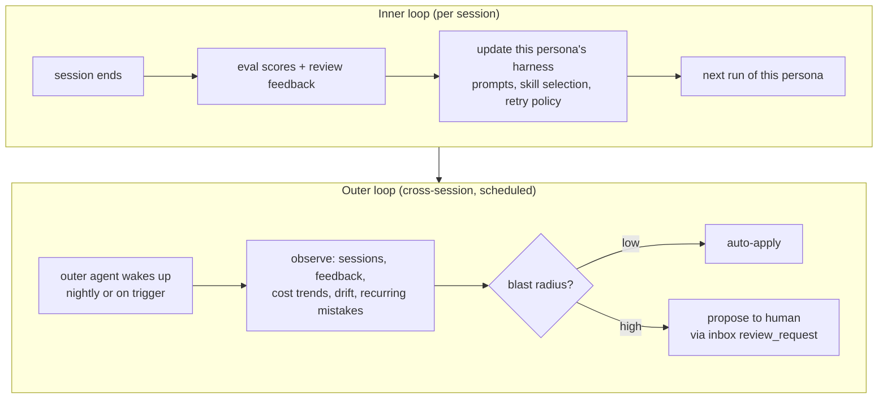

# Outer Improvement Loop

> The outer loop is a scheduled agent that observes *the team using the team*
> and proposes or applies system-level improvements. It operates at the level
> no single session can reach.

**Status:** design decision locked. Implementation tracked in `gctrl/ROADMAP.md`.

This document specifies the outer loop's scope, auto-apply boundary, and
structural safeguards. For the inner loop (per-session harness update) see
`vault/specs/gctrl/PRD.md § inner loop`.

> **The outer loop is the promotion stage of the capability-growth system.** An
> agent can cheaply author a userspace tool (see
> [extension-tiers.md](extension-tiers.md)); the outer loop is what observes
> which agent-authored tools prove valuable across sessions and either promotes
> them to first-class skills (auto-apply) or proposes hardening them into a
> human-authored driver (propose-to-human). Without the missing userspace tier,
> the outer loop can only *retune* existing capability; with it, the loop
> actually *grows* capability while keeping the kernel-invariant boundary intact.

---

## Two loops, two cadences



The inner loop is narrow: one session's signal → one persona's harness, applied
immediately. The outer loop is wide: all sessions, all personas, all directions
→ system-level changes, gated by blast radius.

---

## Why a blast radius boundary matters

Centaur (Paradigm / Tempo, May 2026) ships the same structural insight with a
production deployment: "the agent reviews its own performance, identifies gaps,
and ships fixes to its own skills and tools **without touching the kernel**."
The kernel is the invariant. Skills and tools are the patchable surface.

For gctrl, "kernel" means more than the Rust binary — it means any artifact
whose change could affect multiple personas, all sessions, or the team's shared
security posture. The boundary is drawn by asking: *if this change is wrong,
how bad is the worst case, and how reversible is it?*

---

## Auto-apply zone (outer agent acts unilaterally)

All changes in this zone are: **reversible via git**, **narrow in scope** (one
skill, one persona's config), and **observable** (the change appears in the
vault diff).

| Signal the agent observes | Change applied |
|---|---|
| The same review-feedback constraint appears ≥ 3 times against one persona | Append constraint to that persona's `system_prompt` in `vault/specs/team/personas.md` |
| A sequence of tool calls appears in ≥ 5 high-scoring sessions and has no corresponding skill | Create a new `SKILL.md` in `apps/utils/skills/<name>/` with the pattern extracted |
| An agent-authored userspace tool (skill + proxied `scripts/`) is reused across ≥ 5 sessions with a high score | Promote it to a first-class shipped skill under `apps/utils/skills/` (see [extension-tiers.md](extension-tiers.md)) |
| Sessions tagged with a given direction label consistently over-run cost budget | Raise the `cost_limit_usd` for that direction's label in `vault/specs/team/personas.md` |
| A direction template (`WORKFLOW.md`) is stale (last used > 60 days, no active sessions) | Mark it `status: archived` in frontmatter |
| A skill's `allowed-tools` is consistently broader than what the sessions actually used | Narrow `allowed-tools` in the skill's `SKILL.md` |

**Structural constraint:** the outer agent commits changes to a branch and
opens a PR tagged `outer-loop-auto`. It does **not** self-merge. The PR is
auto-merged by CI after a configurable hold period (default: 24h) unless a
human marks `hold` or closes it. This keeps the auto-apply loop auditable and
trivially revertible.

---

## Propose-to-human zone (outer agent posts inbox message)

Changes in this zone are: **wide in scope**, **affect security posture**, or
**require human judgment** about team intent.

| Signal | Inbox message kind | Why human gating |
|---|---|---|
| The same guardrail denial pattern appears across ≥ 5 distinct personas | `review_request` — "promote to global guardrail?" | Affects all personas; wrong guardrail could block legitimate work |
| A persona's cost trend is > 2× the team average with no clear output correlation | `review_request` — "review BACK-42 persona scope?" | Scoping down a persona is a strategic call |
| A prompt pattern from a high-scoring session looks like a good default starter | `review_request` — "add to default starter prompt?" | Starter prompts affect every future session for that persona |
| New direction type appears frequently with no matching WORKFLOW template | `review_request` — "create direction template for X?" | Requires human to validate the pattern is intentional |
| A driver or tool is called by ≥ 3 personas but has no skill wrapping it | `review_request` — "extract into a first-class skill?" | Promotes something to the skill registry; others may disagree |
| A proxied agent-authored script pattern recurs across ≥ N sessions and would benefit from typed/kernel integration | `review_request` — "harden into a human-authored `driver-foo`?" | A driver is kernel-integrated and human-only ([extension-tiers.md § 4](extension-tiers.md)); the userspace tool is the *evidence* a driver is warranted |
| Any change to a guardrail rule, persona capability grant, or cost quota | Blocked entirely — outer agent must not auto-apply | Security/cost posture is always human-gated |

Inbox messages from the outer loop use:
- `source: outer-loop`
- `kind: review_request`
- `context_type: session` or `context_type: project`
- `requires_action: true` for proposals requiring an explicit decision

---

## What the outer agent cannot touch (kernel-invariant surface)

Even with explicit human proposal + approval, some changes require a
code-review PR rather than a vault edit. The outer agent MUST NOT:

- Modify guardrail policy code (`gctrl-guardrails`).
- Add or remove drivers (`driver-github`, etc.).
- Change the kernel HTTP API surface.
- Modify the secrets store or credential injection rules.
- Change the scheduler's execution model.
- Edit other agents' session history or eval scores retroactively.

These require human authorship + CI + code review. The outer loop's job is to
surface *that* a change is warranted, not to make it.

---

## Outer agent persona

The outer agent runs as a dedicated persona:

```yaml
# vault/specs/team/personas.md addition
- id: outer-loop
  name: System Improvement Agent
  description: >
    Observes the team's operation across sessions and proposes or applies
    bounded system improvements — skill creation, persona tuning, direction
    archiving. Cannot modify guardrails, drivers, or the kernel.
  allowed-tools:
    - Read
    - Bash(gctrl sessions:*)
    - Bash(gctrl inbox post)
    - Bash(git checkout -b outer-loop/*)
    - Bash(git commit)
    - Bash(gh pr create)
    - Write(apps/utils/skills/**/SKILL.md)
    - Write(vault/specs/team/personas.md)
  cost_limit_usd: 2.00   # per nightly run
  schedule: "0 3 * * *"  # 3 AM daily
```

The `allowed-tools` list is the structural boundary. The guardrails engine
enforces it at every tool call — the outer agent cannot call tools it isn't
granted, including any `Write` to paths outside its declared scope.

---

## Relationship to the inner loop

The outer loop *reads* inner-loop outputs (eval scores, review feedback stored
as `board_events` and `inbox_actions`) but does not modify them. The inner loop
operates within a session; the outer loop is a separate session that treats
inner-loop outputs as immutable read-only signal.

---

## References

- `vault/specs/gctrl/PRD.md § outer loop` — goals and motivation.
- `vault/specs/architecture/skills.md` — skill format the outer loop creates.
- `vault/specs/team/personas.md` — persona definitions the outer loop may update.
- `vault/specs/architecture/kernel/proxy-credential-injection.md` — why the
  outer agent cannot touch the kernel's security model unilaterally.
- Centaur (Paradigm / Tempo, May 2026) — "nightly reflection; bounded blast
  radius; kernel is immutable." Production validation of this design.
