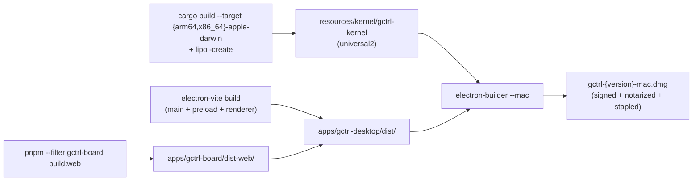

# gctrl Desktop — Electron Implementation

Implementation reference for the Electron-based macOS distribution. The architecture, layer boundaries, and stack-choice rationale live in [architecture/apps/gctrl-desktop.md](../../architecture/apps/gctrl-desktop.md). This document covers concrete tooling, project layout, build pipeline, signing/notarization, auto-update, and CI.

## Project Layout

The desktop app lives under `apps/gctrl-desktop/`. It does not introduce a new domain app — it is a packaging layer that consumes the existing React frontend from `apps/gctrl-board/web/` and the Rust kernel binary built by `kernel/`.

```
apps/gctrl-desktop/
├── package.json                      ← electron-builder + electron-updater deps
├── electron.vite.config.ts           ← electron-vite multi-target build
├── tsconfig.json
├── src/
│   ├── main/                         ← Electron main process (Node)
│   │   ├── index.ts                  ← app lifecycle, window mgmt, Login Item
│   │   ├── kernel-sidecar.ts         ← lifecycle — port-injected; singleton probe + watchdog
│   │   ├── health-check.ts           ← /health probe adapter; gates the singleton check
│   │   ├── login-item.ts             ← one-time macOS Login Item registration
│   │   ├── spawner.ts                ← production Spawner (child_process.spawn)
│   │   ├── scheduler.ts              ← production Scheduler (globalThis.setTimeout)
│   │   ├── paths.ts                  ← kernel binary + data dir resolution
│   │   ├── menu.ts                   ← native macOS menu bar
│   │   └── updater.ts                ← electron-updater integration
│   └── preload/
│       └── index.ts                  ← contextBridge (intentionally minimal)
├── build/
│   ├── entitlements.mac.plist        ← hardened-runtime entitlements
│   ├── icon.icns
│   └── notarize.cjs                  ← @electron/notarize afterSign hook
├── resources/
│   └── kernel/                       ← populated at build time by CI
│       └── gctrl-kernel              ← universal2 binary (built by cargo + lipo)
└── README.md
```

The renderer is *not* in this package. The build pipeline copies the prebuilt SPA bundle from `apps/gctrl-board/dist-web/` into the Electron `dist/` output. This ensures one source of truth for the React UI across all runtime modes.

## Tooling

| Tool | Purpose | Notes |
|------|---------|-------|
| **`electron-vite`** | Multi-target Vite build for main + preload + renderer | Picked over Electron Forge: forge's Vite plugin is still marked experimental |
| **`electron-builder`** | Packaging into `.app` / `.dmg`, code signing, ASAR, autoupdate metadata | Industry standard; supports `extraResources` for sidecar binary |
| **`@electron/notarize`** | Apple notarization via `notarytool` | Invoked from `electron-builder`'s `afterSign` hook |
| **`electron-updater`** | Auto-update from a hosted feed | Used with `generic` provider (R2-hosted JSON manifest) or GitHub Releases |
| **`@1password/electron-hardener`** | Optional: defense-in-depth wrapper from 1Password | Locks down powerful Electron APIs not used by the renderer |
| **vanilla cargo + `lipo`** | Build Rust kernel for both `apple-darwin` arches and fuse into universal2 | macOS host required; Apple SDK handles the x86_64 cross-compile from Apple Silicon. (We tried `cargo-zigbuild` for one-command output, but zig's `ar` is incompatible with the `ring` crate's bundled assembly — see § Universal Kernel Binary.) |

`pnpm` is the package manager — consistent with the rest of the workspace. The `apps/gctrl-desktop` package is registered in `pnpm-workspace.yaml`.

## Build Pipeline

End-to-end build for a release `.dmg`:



### `electron-builder` Configuration

`apps/gctrl-desktop/package.json` `build` section:

```json
{
  "build": {
    "appId": "dev.fractalbox.gctrl",
    "productName": "gctrl",
    "directories": {
      "buildResources": "build",
      "output": "release"
    },
    "files": [
      "dist/**/*",
      "package.json"
    ],
    "extraResources": [
      {
        "from": "resources/kernel/",
        "to": "kernel/",
        "filter": ["**/*"]
      }
    ],
    "asar": true,
    "asarUnpack": ["resources/kernel/**"],
    "mac": {
      "category": "public.app-category.developer-tools",
      "target": [
        { "target": "dmg", "arch": ["universal"] }
      ],
      "hardenedRuntime": true,
      "gatekeeperAssess": false,
      "entitlements": "build/entitlements.mac.plist",
      "entitlementsInherit": "build/entitlements.mac.plist",
      "notarize": false
    },
    "afterSign": "build/notarize.cjs",
    "publish": {
      "provider": "generic",
      "url": "https://updates.gctrl.dev/mac"
    }
  }
}
```

Key flags:

- **`asarUnpack: ["resources/kernel/**"]`** — without this, the kernel binary is packed inside `app.asar` and cannot be `execFile`'d.
- **`hardenedRuntime: true`** + entitlements file — required for notarization and for V8 JIT to function.
- **`notarize: false`** at the builder level — we run notarization explicitly from `afterSign` for better error visibility and CI logging.
- **`target: dmg, arch: universal`** — produces a single universal2 DMG. The `extraResources` kernel binary must also be universal2 (built via vanilla cargo + `lipo`).

### Hardened-Runtime Entitlements

`build/entitlements.mac.plist`:

```xml
<?xml version="1.0" encoding="UTF-8"?>
<!DOCTYPE plist PUBLIC "-//Apple//DTD PLIST 1.0//EN" "http://www.apple.com/DTDs/PropertyList-1.0.dtd">
<plist version="1.0">
<dict>
  <key>com.apple.security.cs.allow-jit</key>
  <true/>
  <key>com.apple.security.cs.allow-unsigned-executable-memory</key>
  <true/>
  <key>com.apple.security.cs.disable-library-validation</key>
  <true/>
  <key>com.apple.security.network.client</key>
  <true/>
  <key>com.apple.security.network.server</key>
  <true/>
</dict>
</plist>
```

Rationale per entitlement:

- `allow-jit` — Electron's V8 JIT compiles JS to native code at runtime.
- `allow-unsigned-executable-memory` — V8 writes generated code to RWX pages.
- `disable-library-validation` — Electron loads its own native modules (e.g. ASAR helpers) that aren't signed by Apple.
- `network.client` — the renderer makes outbound HTTP to the kernel sidecar on `127.0.0.1:4318` and to update feeds.
- `network.server` — the kernel sidecar binds a listening socket on `127.0.0.1:4318`. *Note: Apple may flag inbound connections at MAS review; this is one of the reasons we skip MAS for v1.*

### Universal Kernel Binary (vanilla cargo + `lipo`)

```sh
# One-time setup (no zig required)
rustup target add aarch64-apple-darwin x86_64-apple-darwin

# Build each arch separately (Apple SDK handles the x86_64 cross-compile
# from arm64), then fuse them into a universal2 binary with lipo.
cargo build --release --target aarch64-apple-darwin --workspace --bin gctrld
cargo build --release --target x86_64-apple-darwin  --workspace --bin gctrld

# Verify both arches built
file target/aarch64-apple-darwin/release/gctrld
file target/x86_64-apple-darwin/release/gctrld

# Fuse + stage under the consumer-facing name
mkdir -p apps/gctrl-desktop/resources/kernel
lipo -create \
  -output apps/gctrl-desktop/resources/kernel/gctrl-kernel \
  target/aarch64-apple-darwin/release/gctrld \
  target/x86_64-apple-darwin/release/gctrld

file apps/gctrl-desktop/resources/kernel/gctrl-kernel
# → Mach-O universal binary with 2 architectures: [arm64], [x86_64]
```

We initially tried `cargo-zigbuild` for single-command universal2 output, but zig's C toolchain is incompatible with the `ring` crate's bundled assembly (zig's `ar` fails to link `libring_core_*.a`). Vanilla cargo + `lipo` works because each per-arch build uses Apple's own toolchain. Trade-off: requires a macOS host (zigbuild would have worked on Linux runners). For gctrl this is fine — we already need macos-14 for `electron-builder` to sign and notarize.

## Kernel Sidecar Lifecycle

`src/main/kernel-sidecar.ts` is the only place where the kernel binary is spawned, watched, and shut down. The lifecycle is split into a pure `KernelSidecar` class (state machine, restart policy, singleton-probe gating) and three adapters: `spawner.ts` (production `child_process.spawn`), `scheduler.ts` (`globalThis.setTimeout`), `health-check.ts` (loopback `fetch` to `/health`). The class owns the rules; the adapters own the side-effects. See `apps/gctrl-desktop/src/main/kernel-sidecar.ts` for the canonical source — do not duplicate it here.

**Lifecycle states:** `idle → probing → running | external` on start; `running → restartQueued → probing` on a watchdog crash; `* → stopping → stopped` on quit.

**Singleton probe.** Before each spawn, and again on every watchdog respawn, the lifecycle calls `healthCheck(config)` which probes `http://127.0.0.1:<port>/health` and asserts the gctrl response body shape (`{"status":"ok",...}`). When a daemon already answers, the sidecar transitions to `external` and never spawns. This makes a brew/cargo `gctrld` install or a leftover prior session win cleanly — no race for `:4318`, no race for the DuckDB writer lock. A monotonic probe-epoch counter guards against verdicts from probes superseded by a later `start()` call.

**Invariants:**

1. The kernel binds `127.0.0.1` exclusively. Never `0.0.0.0`. (This avoids inadvertently exposing the local kernel on a shared network and reduces App Store review risk.)
2. The kernel's `--db` is always `app.getPath("userData") + "/kernel/gctrl.duckdb"`, mapping to `~/Library/Application Support/<bundle-id>/kernel/` on macOS. This directory survives app uninstall.
3. The renderer never spawns the kernel and never knows where the binary is. All kernel access is HTTP.
4. Watchdog uses bounded exponential backoff (`RESTART_BACKOFF_MS`); each respawn re-probes for an external daemon first, so a CLI install brought up between crashes is honored. There is no in-app "restart kernel" UI today; if needed, a renderer button could call back into the main process via IPC and `start()` again, since the lifecycle resets backoff after `stop()`.

## Login Item (autostart)

The desktop `.app` registers itself as a macOS Login Item on first packaged launch via `app.setLoginItemSettings({ openAtLogin: true })`. On macOS 13+ Electron delegates to `SMAppService.mainApp` — no separate launchd plist, no extra entitlements beyond what's already in `build/entitlements.mac.plist`. The bundled `gctrld` sidecar is then up before any `gctrl://` click, terminal `gctrl` invocation, or scheduled job hits the kernel HTTP API.

Registration is one-time, gated by a marker file at `<userData>/login-item-registered`. A user who unticks gctrl in System Settings → General → Login Items is NOT silently re-enabled on the next launch. The decision logic lives in `src/main/login-item.ts` (pure, port-injected, unit-tested); the wrapper in `index.ts` wires it to Electron and `node:fs` and tolerates marker-write failures (full disk, sandbox) without crashing the app.

## Renderer Wiring

The React SPA from `apps/gctrl-board/web/` is reused unchanged except for two configuration points:

1. **Router** — switch from `BrowserRouter` to `HashRouter` (or `app://` custom protocol) so file:// loads work.
2. **API base URL** — the existing `request<T>(path)` wrapper in `web/src/api/` reads from a build-time environment variable. Desktop builds set it to `http://127.0.0.1:4318`; cloud builds leave it empty (relative paths resolve to the Worker origin).

```typescript
// web/src/api/base.ts
export const API_BASE =
  import.meta.env.VITE_API_BASE ?? ""  // "" in cloud mode → relative to current origin
```

```sh
# Cloud build (existing)
pnpm --filter gctrl-board build:web

# Desktop build
VITE_API_BASE=http://127.0.0.1:4318 pnpm --filter gctrl-board build:web
```

Everything else — components, drag-drop, EventSource for `/api/sessions/:id/stream`, analytics views — is identical between cloud and desktop.

### Preload Script (Minimal)

`src/preload/index.ts` exposes only what the renderer needs that *cannot* be accomplished with `fetch`. Per the architecture, this should be near-empty.

```typescript
import { contextBridge, ipcRenderer } from "electron"

contextBridge.exposeInMainWorld("desktop", {
  openExternal: (url: string) => ipcRenderer.invoke("open-external", url),
  showInFinder: (path: string) => ipcRenderer.invoke("show-in-finder", path),
  appVersion: () => ipcRenderer.invoke("app-version"),
})
```

`nodeIntegration: false`, `contextIsolation: true`, `sandbox: true` are non-negotiable.

## Code Signing and Notarization

### One-Time Apple Setup

1. Apple Developer Program membership ($99/yr).
2. Generate `Developer ID Application` certificate via Apple Developer portal or Xcode → export as `.p12` with password.
3. Generate App Store Connect API key (Users and Access → Keys → App Manager role) → download `.p8`, note Key ID and Issuer ID.
4. Register the bundle ID `dev.fractalbox.gctrl` (placeholder — replace with chosen ID).

### Required Environment Variables (CI)

| Variable | Purpose |
|---|---|
| `CSC_LINK` | Base64-encoded `.p12` file contents (passed to `electron-builder`) |
| `CSC_KEY_PASSWORD` | Password for the `.p12` |
| `APPLE_API_KEY` | Path to the App Store Connect API key (`.p8`) |
| `APPLE_API_KEY_ID` | Key ID from App Store Connect |
| `APPLE_API_ISSUER` | Issuer ID from App Store Connect |
| `APPLE_TEAM_ID` | 10-character Apple Team ID |

`electron-builder` reads `CSC_LINK` / `CSC_KEY_PASSWORD` and signs every binary inside the `.app`. The `afterSign` hook then notarizes:

```javascript
// build/notarize.cjs
const { notarize } = require("@electron/notarize")

exports.default = async function notarizing(context) {
  const { electronPlatformName, appOutDir } = context
  if (electronPlatformName !== "darwin") return
  const appName = context.packager.appInfo.productFilename
  return notarize({
    tool: "notarytool",
    appPath: `${appOutDir}/${appName}.app`,
    appleApiKey: process.env.APPLE_API_KEY,
    appleApiKeyId: process.env.APPLE_API_KEY_ID,
    appleApiIssuer: process.env.APPLE_API_ISSUER,
    teamId: process.env.APPLE_TEAM_ID,
  })
}
```

### Sidecar Signing

The kernel binary inside `Contents/Resources/kernel/gctrl-kernel` MUST be signed individually with the same Developer ID Application identity. `electron-builder` signs `extraResources` automatically *if* they are flagged as binaries — this happens by default for files without a recognized text extension. Verify after every build:

```sh
codesign --verify --deep --strict --verbose=2 "release/mac/gctrl.app"
spctl -a -t exec -vv "release/mac/gctrl.app"
```

If the sidecar is unsigned, Gatekeeper rejects the bundle on a fresh Mac (works locally, fails when downloaded). This is the most common first-ship failure — always test by downloading the DMG to a Mac that has never had your dev cert in its keychain.

## Auto-Update

`electron-updater` checks an update feed on app launch and at 4-hour intervals. v1 uses a `generic` provider hosted on Cloudflare R2:

```
https://updates.gctrl.dev/mac/
├── latest-mac.yml          ← electron-updater manifest
├── gctrl-1.2.3-mac.dmg
├── gctrl-1.2.3-mac.zip     ← required by electron-updater for delta updates
└── gctrl-1.2.3-mac.dmg.blockmap
```

The manifest is regenerated by `electron-builder` during `pnpm release` and uploaded to R2 by CI alongside the DMG. Updates are signed by the same Developer ID certificate; Squirrel verifies the signature before applying.

```typescript
// src/main/updater.ts
import { autoUpdater } from "electron-updater"

export const initAutoUpdater = () => {
  autoUpdater.logger = console
  autoUpdater.autoDownload = true
  autoUpdater.autoInstallOnAppQuit = true
  autoUpdater.checkForUpdatesAndNotify().catch(console.error)
  setInterval(() => autoUpdater.checkForUpdatesAndNotify().catch(console.error), 4 * 60 * 60 * 1000)
}
```

## CI Workflow Sketch

`.github/workflows/release-mac.yml` (skeleton — to be implemented when desktop work begins):

```yaml
name: release-mac
on:
  push:
    tags: ["v*"]
  workflow_dispatch:

jobs:
  release:
    runs-on: macos-14   # arm64 runner with full Apple SDK for x86_64 cross-compile
    steps:
      - uses: actions/checkout@v4
      - uses: actions/setup-node@v4
        with: { node-version: 20 }
      - uses: pnpm/action-setup@v4
        with: { version: 9 }
      - uses: dtolnay/rust-toolchain@stable
        with: { targets: aarch64-apple-darwin,x86_64-apple-darwin }

      - name: Build kernel (universal2 via cargo + lipo)
        run: |
          cargo build --release --target aarch64-apple-darwin --workspace --bin gctrld
          cargo build --release --target x86_64-apple-darwin  --workspace --bin gctrld
          mkdir -p apps/gctrl-desktop/resources/kernel
          lipo -create \
            -output apps/gctrl-desktop/resources/kernel/gctrl-kernel \
            target/aarch64-apple-darwin/release/gctrld \
            target/x86_64-apple-darwin/release/gctrld

      - name: Build web bundle
        run: |
          pnpm install --frozen-lockfile
          VITE_API_BASE=http://127.0.0.1:4318 pnpm --filter gctrl-board build:web

      - name: Build + sign + notarize
        env:
          CSC_LINK: ${{ secrets.MAC_CSC_LINK }}
          CSC_KEY_PASSWORD: ${{ secrets.MAC_CSC_KEY_PASSWORD }}
          APPLE_API_KEY: ${{ runner.temp }}/apple_key.p8
          APPLE_API_KEY_ID: ${{ secrets.APPLE_API_KEY_ID }}
          APPLE_API_ISSUER: ${{ secrets.APPLE_API_ISSUER }}
          APPLE_TEAM_ID: ${{ secrets.APPLE_TEAM_ID }}
        run: |
          echo "${{ secrets.APPLE_API_KEY_BASE64 }}" | base64 -d > "$APPLE_API_KEY"
          pnpm --filter gctrl-desktop build
          pnpm --filter gctrl-desktop release

      - name: Upload to R2
        env:
          R2_ACCESS_KEY_ID: ${{ secrets.R2_ACCESS_KEY_ID }}
          R2_SECRET_ACCESS_KEY: ${{ secrets.R2_SECRET_ACCESS_KEY }}
          R2_BUCKET: ${{ secrets.R2_BUCKET }}
        run: |
          # rclone or aws s3 cp with --endpoint-url
          aws s3 cp apps/gctrl-desktop/release/ s3://$R2_BUCKET/mac/ \
            --endpoint-url https://<account>.r2.cloudflarestorage.com \
            --recursive --exclude "*" \
            --include "*.dmg" --include "*.zip" --include "*.yml" --include "*.blockmap"
```

## Local Development

Two distinct local-dev modes for the desktop app:

| Mode | Command | What runs |
|---|---|---|
| **Renderer dev (hot reload)** | `pnpm --filter gctrl-desktop dev` | electron-vite hot-reloads main + renderer; kernel must be started separately (`cargo run -- serve` or `gctrl serve`). Sidecar construction is skipped in dev. |
| **Production-shaped local build** | `pnpm --filter gctrl-desktop build && open release/mac/gctrl.app` | Builds the bundle without signing; useful for catching bundling regressions. The bundled sidecar singleton-probes `:4318` on launch, so a CLI `gctrld` already running wins and the bundled binary defers cleanly. |

The renderer-dev mode is the day-to-day workflow. The bundled-kernel mode is for pre-release verification.

## First-Ship Checklist

1. ☐ Apple Developer Program membership active
2. ☐ `Developer ID Application` cert in Keychain + `.p12` exported with password
3. ☐ App Store Connect API key (`.p8`, key ID, issuer ID) generated
4. ☐ Bundle ID registered (`dev.fractalbox.gctrl` or chosen)
5. ☐ `cargo build` + `lipo` produce a universal2 kernel binary that runs on both arm64 and x86_64 Macs
6. ☐ `electron-builder` config with `extraResources` + `asarUnpack` + hardened-runtime entitlements
7. ☐ `afterSign` notarize hook produces a stapled `.dmg`
8. ☐ Verified: `codesign --verify --deep` and `spctl -a -t exec` both pass
9. ☐ **Downloaded the DMG to a Mac that has never had your dev cert in its keychain**, opened it, app launches without Gatekeeper warning
10. ☐ Auto-update feed (`latest-mac.yml`) hosted on R2; version bump triggers update on a stale install
11. ☐ R2 / Cloudflare credentials stored in GitHub Actions secrets
12. ☐ CI workflow produces a signed DMG end-to-end on tag push

## Known Failure Modes

| Symptom | Likely cause |
|---|---|
| App launches, Gatekeeper says "damaged" on a fresh Mac | Sidecar binary not signed; check `codesign --verify --deep` |
| App quits immediately on launch with `EXC_BAD_ACCESS` in V8 | Missing `com.apple.security.cs.allow-jit` entitlement |
| Auto-update never finds new version | `latest-mac.yml` not regenerated, or `publish.url` mismatch |
| Kernel never starts; `kernel-sidecar.ts` logs ENOENT | `asarUnpack` missing for `resources/kernel/**` |
| Notarization succeeds but Gatekeeper still complains | Missing `xcrun stapler staple` step (electron-builder runs this automatically; verify) |
| First-launch hang, then works | macOS quarantine xattr; user must allow once via System Settings → Privacy & Security |

## Out of Scope

The implementation is intentionally narrow. The following are explicit non-goals for v1 and should not be added without revisiting [architecture/apps/gctrl-desktop.md](../../architecture/apps/gctrl-desktop.md):

- Mac App Store target (separate provisioning profile, sandbox entitlements, and the localhost-kernel review risk)
- Windows / Linux build targets
- Custom IPC bridge for kernel data (`fetch` to localhost is sufficient and keeps cloud + desktop unified)
- Multi-window / multi-tab UI (the React SPA is single-window today)
- Native macOS menu bar / status bar (tray) UX (post-v1; possible to add via `Tray` API without architectural changes)

## Related

- [architecture/apps/gctrl-desktop.md](../../architecture/apps/gctrl-desktop.md) — desktop app architecture and stack rationale
- [architecture/apps/gctrl-mobile.md](../../architecture/apps/gctrl-mobile.md) — mobile companion (separate codebase)
- [implementation/apps/deployment.md](deployment.md) — Cloudflare Worker deployment (cloud runtime)
- [architecture/os.md](../../architecture/os.md) — Unix layer model
