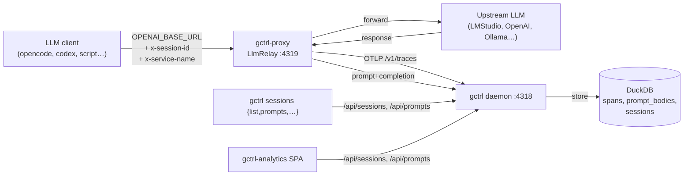

# Integration: LLM Relay — capture OpenAI-compat agent traffic

How any external CLI or script that talks to an OpenAI-compatible LLM
endpoint lands in gctrl analytics — sessions, prompts, cost, latency —
as a first-class **external agent** alongside `claude-code` and `codex`.

The relay is **agnostic by design**: it forwards `/v1/chat/completions`
to a configurable upstream and captures both directions, with the
caller supplying the service identity via headers. This spec covers the
generic mechanism, with opencode + LMStudio as the worked example that
motivated it.

This is a concrete integration spec, not a kernel feature spec. Kernel
work it relies on already lives in
[gctrl-analytics](../architecture/apps/gctrl-analytics.md) M3
(`session.created_by`) and
[orchestrator](../architecture/kernel/orchestrator.md). The open
prompt-storage choice from the analytics M2 ADR is resolved here:
**option B — dedicated `prompt_bodies` table** — because proxy capture
makes random-access joins on prompt text the operator's primary read
pattern.

## Why this spec exists

Many agent CLIs (opencode 1.14.25, ad-hoc scripts using `@ai-sdk/openai-compatible`
or the OpenAI Python SDK, …) **do not register an OpenTelemetry tracer
provider**. Setting `OTEL_EXPORTER_OTLP_TRACES_ENDPOINT` against the
kernel is a no-op for them, so the recommendation in
[gctrl-analytics §Internal vs. External](../architecture/apps/gctrl-analytics.md#internal-vs-external-agent-attribution)
— "external agents push OTLP into `/v1/traces`" — only applies to
agents that opt in. We need a capture path that works for the rest.

The path also has to capture **prompt and completion bodies**, not just
metadata, because the value of an agentic CLI is the loop (tool calls,
file diffs, reasoning) and an analytics surface that shows only token
counts is useless for understanding what the agent actually did.

## Architecture



Two transports, one storage:

1. **OpenAI-compat HTTP relay** in `gctrl-proxy` listens on `:4319` for
   `POST /v1/chat/completions`. The client is configured to point at
   this URL instead of the LLM provider directly. The relay forwards
   verbatim to a configurable upstream, captures request and response,
   and writes both an OTLP span (to the kernel's own `/v1/traces`
   endpoint, same path external agents already use) and prompt-body
   rows (to a new `prompt_bodies` table) keyed by `session_id` +
   `turn_ordinal`.
2. **Session correlation** is via two headers the client supplies:
   - `x-session-id` — UUID minted per agent run; ties all spans + bodies
     of that run together.
   - `x-service-name` — short identifier of the calling tool
     (`opencode`, `codex`, `my-script`); becomes the `service.name`
     resource attribute on the OTel span and the session's `agent_name`.

Neither header is required. Without them the relay still forwards
correctly; capture is skipped for missing `x-session-id` (we won't
write orphan rows) and `x-service-name` falls back to the relay's
configured `default_service_name` (default `llm-client`).

The kernel storage path is unchanged — same OTLP receiver, same
auto-create of `Session{ created_by: OtelIngest, agent_name: <service> }`
on first span. The relay is just an OTel emitter that happens to also
store request bodies.

### Why a relay, not MITM

A general HTTPS MITM (hudsucker + CA injection) is the eventual right
answer for arbitrary cloud providers (Anthropic API, OpenAI cloud, …).
For the local-host case (LMStudio, Ollama) the traffic is **HTTP on
loopback** — no TLS, no CA trust dance — so an HTTP forward relay is
one or two orders of magnitude cheaper to ship and gives identical
capture fidelity. The MITM path remains the kernel-proxy Phase 2 work
tracked in
[gctrl-analytics §M4](../architecture/apps/gctrl-analytics.md#milestones).

## Components

### Kernel — `gctrl-proxy` LLM relay

In `kernel/crates/gctrl-proxy/`:

- `LlmRelay` — `axum` server bound to `:4319` (configurable). Single
  matched route: `POST /v1/chat/completions`. Other paths return `501
  Not Implemented` with a body pointing at this spec.
- `RelayConfig` carries `upstream_url`, `session_header`
  (default `x-session-id`), `service_header` (default `x-service-name`).
- Request handling:
  1. Read body, parse `model`, `messages`. Forward verbatim to the
     upstream URL with original headers minus `Host`.
  2. On response, parse `choices[0].message`, `usage.prompt_tokens`,
     `usage.completion_tokens`. **Streaming responses** (upstream
     `Content-Type: text/event-stream`) are tee'd: bytes pass through
     to the client live so the agent's UX is preserved, while the
     relay accumulates a copy and reassembles it via
     `parse_sse_to_response` (concatenates per-choice `delta.content`,
     reads `usage` from the final chunk, ignores `[DONE]` and
     keepalives) before running the same capture path.
  3. Emit one OTLP span to `/v1/traces` with attributes:
     `service.name=<x-service-name or default>`, `session.id=<x-session-id>`,
     `gen_ai.request.model`, `gen_ai.usage.prompt_tokens`,
     `gen_ai.usage.completion_tokens`, and a best-effort `gen_ai.system`
     derived from the upstream URL host (`lmstudio` for `:1234`,
     `ollama` for `:11434`, `openai` for `api.openai.com`, etc.).
  4. Insert one `prompt_bodies` row per `messages[]` turn plus one for
     the assistant response, all sharing the span's `trace_id`.
  5. Return upstream response verbatim.
- Failure mode: if the kernel daemon is down, capture is dropped (logs
  a `tracing::warn!`) but the relay still forwards the request.
  Telemetry must never break the agent loop.

Crate dependencies: `axum`, `hyper`, `reqwest`, `serde`, `serde_json`,
`sha2`. The crate already had `tokio`, `chrono`, `uuid`,
`gctrl-storage`.

### Storage — `prompt_bodies` table

New table in `kernel/crates/gctrl-storage/src/schema.rs`:

```sql
CREATE TABLE IF NOT EXISTS prompt_bodies (
    id              VARCHAR PRIMARY KEY,
    session_id      VARCHAR NOT NULL,
    span_id         VARCHAR,            -- NULL when relay can't link to a span
    trace_id        VARCHAR,
    turn_ordinal    INTEGER NOT NULL,   -- position in the request's messages[]
    role            VARCHAR NOT NULL,   -- system | user | assistant | tool
    content         VARCHAR NOT NULL,   -- raw text; tool_calls JSON-stringified
    fingerprint     VARCHAR NOT NULL,   -- sha256(normalized content)
    tokens          INTEGER,            -- best-effort, NULL if not in usage
    created_at      VARCHAR NOT NULL
);
CREATE INDEX IF NOT EXISTS idx_prompt_bodies_session ON prompt_bodies(session_id);
CREATE INDEX IF NOT EXISTS idx_prompt_bodies_fingerprint ON prompt_bodies(fingerprint);
```

This is the M2-ADR option B from
[gctrl-analytics §3](../architecture/apps/gctrl-analytics.md#3-get-apiprompts--get-apisessionsidprompts--storage-for-prompt-turns).
Decision: **B over A**. Reasoning:

- Bodies can be hundreds of KB; loading them as a span attribute is
  wrong for the typical "show me the trace tree" path.
- Operators want to grep/group prompts by fingerprint — a dedicated
  table with an index does that cheaply.
- Existing `prompt_versions` is template-only (hash + content for
  reusable templates); `prompt_bodies` covers the per-turn instance
  story those tables don't.

The two read routes from gctrl-analytics §3 land here:

- `GET /api/sessions/{id}/prompts` — `SELECT * FROM prompt_bodies
  WHERE session_id = ? ORDER BY turn_ordinal`.
- `GET /api/prompts?group_by=fingerprint&since=...&limit=...` — group +
  count.

### Shell — generic surface, no per-agent commands

The shell does **not** add per-agent subcommands. Filtering by agent
already works through the global `--agent` flag on the existing
`gctrl sessions list`:

```sh
gctrl sessions list --agent opencode --limit 10
gctrl sessions list --agent codex
```

The new capability — viewing captured prompt bodies — lives on the
generic `sessions` namespace:

```sh
gctrl sessions prompts <session-id>
gctrl sessions prompts <session-id> --truncate 0   # full content
```

Operators run their tool of choice with the right env vars exported
themselves; the shell stays out of the launcher business. See
[Operator setup](#operator-setup) for the exact env block.

## Operator setup

### opencode + LMStudio (the worked example)

One-time, in `~/.config/opencode/opencode.json`:

```jsonc
{
  "$schema": "https://opencode.ai/config.json",
  "provider": {
    "lmstudio": {
      "npm": "@ai-sdk/openai-compatible",
      "name": "LM Studio (via gctrl)",
      "options": {
        "baseURL": "http://127.0.0.1:4319/v1"
      },
      "models": {
        "google/gemma-3-26b": { "name": "gemma-3-26b (local via gctrl)" }
      }
    }
  }
}
```

Per run, attach the session id + service name as headers. opencode (and
the AI SDK in general) lets you set custom headers on the provider via
the `headers` option, or you can run through a small wrapper:

```sh
SESSION=$(uuidgen)
OPENAI_BASE_URL=http://127.0.0.1:4319/v1 \
OPENAI_API_KEY=lm-studio \
opencode --header "x-session-id: $SESSION" \
         --header "x-service-name: opencode" \
         "fix the failing test in apps/board"
```

### Generic (any OpenAI-compatible client)

The relay doesn't care what the client is — anything that speaks
`POST /v1/chat/completions` works:

```sh
SESSION=$(uuidgen)
curl -X POST http://127.0.0.1:4319/v1/chat/completions \
  -H "content-type: application/json" \
  -H "x-session-id: $SESSION" \
  -H "x-service-name: my-script" \
  -d '{"model":"gpt-4o","messages":[{"role":"user","content":"hi"}]}'
```

Both will appear in `gctrl sessions list --agent opencode` /
`--agent my-script`, with prompt bodies queryable via
`gctrl sessions prompts <session-id>` and the SPA's Prompts tab once
M2 lands.

### Verify

```sh
gctrl sessions list --agent opencode --limit 5
gctrl sessions prompts <id>
gctrl analytics cost      # opencode (or whatever service.name) shows up in by_agent
gctrl analytics latency
```

## Milestones

1. **M0 — Capture path** *(shipped)*
   - `gctrl-proxy` `LlmRelay` + `Capture` (storage + OTLP).
   - `prompt_bodies` schema + storage helpers.
   - Daemon (`gctrld serve`) auto-mounts the relay alongside the OTLP
     receiver; `--relay-port`, `--relay-upstream`, `--no-relay` flags.
   - *Accept*: with an upstream LLM running and the relay on `:4319`,
     a chat-completions request appears as a session in
     `gctrl sessions list` and prompt bodies are queryable in DuckDB.
     Verified by integration tests and live smoke against the
     release-built `gctrld`.
2. **M1 — Read routes** *(shipped)*
   - `GET /api/sessions/{id}/prompts` and
     `GET /api/prompts?group_by=fingerprint&since=...&limit=...`.
   - `gctrl sessions prompts <id>` shell command.
   - *Accept*: routes return rows the M0 capture wrote, with stable
     ordering and fingerprint counts that match a manual SQL `GROUP BY`.
3. **M2 — Web UI**
   - Wire the Prompts tab in `gctrl-analytics` against the M1 routes.
     Pure UI work; closes
     [gctrl-analytics M2b](../architecture/apps/gctrl-analytics.md#milestones).
   - *Accept*: opening a Sessions detail pane on any external session
     shows the full prompt + completion turn list with drill-through.
4. **M3 — Generalize beyond OpenAI-compat** *(separate spec)*
   - Add `POST /v1/messages` (Anthropic shape) and any other shapes the
     operator's tools actually use. The capture core (turns →
     `prompt_bodies` + OTLP span) doesn't change; only the request
     parser does. Precondition for the
     [gctrl-analytics §M4 Network sub-panel](../architecture/apps/gctrl-analytics.md#milestones).

## Convergence with `driver-llm`

Eventually, agents should not need a relay at all — they should call
**the kernel's own LLM endpoint**. From the
[uebermensch architecture spec](../architecture/apps/researcher-market.md)
(referenced in `MEMORY.md`), `driver-llm` is the planned L1 driver
exposing:

- `POST /api/llm/messages` (Anthropic-shape)
- `POST /api/llm/completions` (OpenAI-compat)

Once those land, clients flip their `OPENAI_BASE_URL` from
`http://localhost:4319/v1` (the relay) to `http://localhost:4318/v1`
(driver-llm) — same kernel daemon, same auth/quota/cost model — and
the relay becomes unnecessary for agents that can be redirected. The
relay still has a job: capturing traffic from agents that won't or
can't be pointed at `driver-llm` (e.g. cloud agents callable only via
their own SDKs).

The `prompt_bodies` schema and the `gctrl sessions prompts` shell
surface **don't** become unnecessary — they're the durable contract.
Only the *emitter* changes:

- `gctrl-proxy` `LlmRelay` keeps its codepath; its default
  `--relay-upstream` flips from LMStudio direct to the kernel's
  `driver-llm` route. Operators pointing clients at the relay still
  work, no client config change needed.
- `prompt_bodies` rows from `driver-llm`-originated calls land via the
  same span-processor path the relay uses today, since `driver-llm`
  emits the same `gen_ai.*` resource attrs.
- The Prompts tab in gctrl-analytics is unchanged.

## Non-Goals

- Not building a generic agent-traffic MITM proxy. That's
  [gctrl-analytics M4](../architecture/apps/gctrl-analytics.md#milestones).
- Not a Claude Code JSONL importer. That's
  [gctrl-analytics §Deferred](../architecture/apps/gctrl-analytics.md#claude-code-jsonl-import).
- Not redacting prompt bodies on the way in. Stored as-is; redaction is
  a future read-time concern.
- Not estimating cost when the upstream doesn't return `usage`.
  `cost_usd` stays `0.0` for those spans; that's accurate, not a bug.
- No per-agent shell namespace (`gctrl opencode`, `gctrl codex`, …).
  Every agent uses the same generic `gctrl sessions ...` surface,
  filtered by `--agent` when needed.

## Open Questions

1. Should the relay also accept `POST /v1/embeddings` and the older
   `POST /v1/completions`? Defer until a real client asks; chat
   completions covers every current use case.
2. Is `prompt_bodies.content` a good idea as `VARCHAR`, or should it be
   `BLOB` for binary tool-call payloads? VARCHAR for now — tool_calls
   are JSON, JSON is text. Revisit if a tool emits binary responses.
3. Per-request `gen_ai.system` override header (e.g. `x-llm-system`)?
   The current URL-based heuristic covers the obvious cases; add a
   header only if a real upstream isn't covered by the heuristic.
