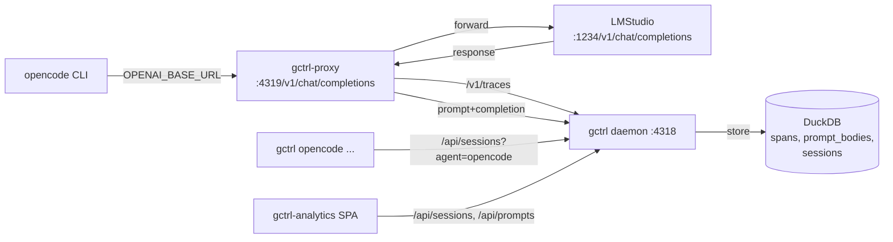

# Integration: opencode + LMStudio (gemma) → gctrl Analytics

How an external `opencode` (sst/opencode) CLI running against a local
LMStudio gemma model lands in gctrl analytics — sessions, prompts, cost,
latency — as a first-class **external agent** alongside `claude-code` and
`codex`.

This is a concrete integration spec, not a kernel feature spec. Kernel
work it relies on already lives in
[gctrl-analytics](../architecture/apps/gctrl-analytics.md) M3 (`session.created_by`)
and [orchestrator](../architecture/kernel/orchestrator.md). Open prompt-storage
choice (M2 ADR) is resolved here for the opencode path: **option B —
dedicated `prompt_bodies` table** — because the proxy capture path makes
random-access joins on prompt text the operator's primary read pattern.

## Why this spec exists

opencode 1.14.25 has **no native OpenTelemetry export**. Setting
`OTEL_EXPORTER_OTLP_TRACES_ENDPOINT` against the kernel is a no-op
because opencode never registers a tracer provider. So the recommendation
in [gctrl-analytics §Internal vs. External](../architecture/apps/gctrl-analytics.md#internal-vs-external-agent-attribution)
— "external agents push OTLP into `/v1/traces`" — does not apply to
opencode out of the box. We need a different capture path.

The path also has to capture **prompt and completion bodies**, not just
metadata, because opencode's value is the agentic loop (tool calls,
file diffs, reasoning) and an analytics surface that shows only token
counts is useless for understanding what the agent actually did.

## Architecture



Two transports, one storage:

1. **OpenAI-compat HTTP relay** in `gctrl-proxy` listens on
   `:4319` for `POST /v1/chat/completions`. opencode is configured to
   point at this URL via its `provider.lmstudio.options.baseURL` config
   key. The relay forwards verbatim to LMStudio at `:1234`, captures
   request and response, and writes both an OTLP span (to the kernel's
   own `/v1/traces` endpoint, same path external agents use) and a
   prompt-body row (to a new `prompt_bodies` table) keyed by
   `session_id` + `turn_ordinal`.
2. **Session correlation** is via an `X-Session-Id` header injected by
   the launcher script. opencode itself doesn't know about sessions;
   the launcher mints a UUID per `opencode` invocation and exports it
   as both `OTEL_RESOURCE_ATTRIBUTES=session.id=<uuid>,service.name=opencode`
   (for the day opencode does emit OTel) **and** as a relay env var
   so the proxy stamps every captured request with the same id.

The kernel storage path is unchanged — same OTLP receiver, same auto-create
of `Session{ created_by: OtelIngest, agent_name: opencode }` on first span.
The relay is just an OTel emitter that happens to also store request
bodies.

### Why a relay, not MITM

A general HTTPS MITM (hudsucker + CA injection) is the eventual right
answer for arbitrary providers (Anthropic, OpenAI cloud, …). For
opencode + LMStudio the traffic is **HTTP on localhost** — no TLS, no CA
trust dance — so an HTTP forward relay is one or two orders of magnitude
cheaper to ship and gives identical capture fidelity. The MITM path
remains the kernel-proxy Phase 2 work tracked in
[gctrl-analytics §M4](../architecture/apps/gctrl-analytics.md#milestones).

## Components

### Kernel — `gctrl-proxy` LLM relay

New in `kernel/crates/gctrl-proxy/`:

- `LlmRelay` — `axum` server bound to `:4319` (configurable). Single
  matched route: `POST /v1/chat/completions`. Other paths return `501
  Not Implemented` with a body pointing at this spec.
- Request handling:
  1. Read body, parse `model`, `messages`, request id (synthesize if
     missing).
  2. Forward to `OPENCODE_LLM_UPSTREAM` (default
     `http://127.0.0.1:1234/v1/chat/completions`) with all original
     headers minus `Host`.
  3. On response, parse `choices[0].message`, `usage.prompt_tokens`,
     `usage.completion_tokens`.
  4. Emit one OTLP span to the kernel's own receiver
     (`POST /v1/traces` on `:4318`) with attributes:
     `service.name=opencode`, `session.id=<X-Session-Id>`,
     `gen_ai.request.model`, `gen_ai.usage.prompt_tokens`,
     `gen_ai.usage.completion_tokens`, `gen_ai.system=lmstudio`.
  5. Insert one `prompt_bodies` row per `messages[]` turn plus one for
     the assistant response, all sharing the span's `trace_id`.
  6. Return upstream response verbatim to opencode.
- Failure mode: if the kernel daemon is down, capture is dropped (we
  log a `tracing::warn!`) but the relay still forwards the request.
  Telemetry must never break the agent loop.

Crate dependencies to add: `axum`, `hyper`, `reqwest`, `serde`,
`serde_json`. The crate already has `tokio`, `chrono`, `uuid`,
`gctrl-storage`.

### Storage — `prompt_bodies` table

New table in `kernel/crates/gctrl-storage/src/schema.rs`:

```sql
CREATE TABLE IF NOT EXISTS prompt_bodies (
    id              VARCHAR PRIMARY KEY,
    session_id      VARCHAR NOT NULL,
    span_id         VARCHAR,            -- NULL when relay can't link to a span
    trace_id        VARCHAR,
    turn_ordinal    INTEGER NOT NULL,   -- position in the request's messages[]
    role            VARCHAR NOT NULL,   -- system | user | assistant | tool
    content         VARCHAR NOT NULL,   -- raw text; tool_calls JSON-stringified
    fingerprint     VARCHAR NOT NULL,   -- sha256(normalized content)
    tokens          INTEGER,            -- best-effort, NULL if not in usage
    created_at      VARCHAR NOT NULL
);
CREATE INDEX IF NOT EXISTS idx_prompt_bodies_session ON prompt_bodies(session_id);
CREATE INDEX IF NOT EXISTS idx_prompt_bodies_fingerprint ON prompt_bodies(fingerprint);
```

This is the M2-ADR option B from
[gctrl-analytics §3](../architecture/apps/gctrl-analytics.md#3-get-apiprompts--get-apisessionsidprompts--storage-for-prompt-turns).
Decision: **B over A** for opencode. Reasoning:

- Bodies can be hundreds of KB; loading them as a span attribute is
  wrong for the typical "show me the trace tree" path.
- Operator wants to grep/group prompts by fingerprint — a dedicated
  table with an index does that cheaply.
- Existing `prompt_versions` is template-only (hash + content for
  reusable templates); `prompt_bodies` covers the per-turn instance
  story those tables don't.

The two read routes from gctrl-analytics §3 land here:

- `GET /api/sessions/{id}/prompts` — `SELECT * FROM prompt_bodies WHERE
  session_id = ? ORDER BY turn_ordinal`.
- `GET /api/prompts?group_by=fingerprint&since=...` — group + count.

Routes are in scope for this work but not strictly blocking the relay
landing — the table can be populated first, routes follow.

### Shell — `gctrl opencode`

Two read commands wrapping existing kernel routes:

```
gctrl opencode sessions [--since 24h] [--limit 20]
gctrl opencode last
```

Both filter `/api/sessions?agent_name=opencode&kind=external`. `last`
shows the most recent session with a brief trace + cost summary;
`sessions` is a table view.

Plus a launcher subcommand that exec's opencode with the right env:

```
gctrl opencode run -- <opencode args>
```

This:
1. Mints a session UUID (`uuid v4`).
2. Sets `OTEL_RESOURCE_ATTRIBUTES`, `OTEL_SERVICE_NAME=opencode`,
   `OTEL_EXPORTER_OTLP_TRACES_ENDPOINT=http://localhost:4318/v1/traces`
   (no-op today, future-proofing for whenever opencode wires AI SDK
   telemetry).
3. Sets `OPENCODE_SESSION_ID=<uuid>` so the relay receives it as a header
   (relay reads either `X-Session-Id` or `OPENCODE_SESSION_ID` from a
   small launcher-injected header).
4. Sets opencode's provider config so it points at the relay (or
   trusts the user has already done that in `~/.config/opencode/opencode.json`).
5. Exec's `opencode` with the remaining args.

The simplest path for step 4 is **not** to mutate user config; instead
document the one-time `opencode.json` change in this spec and have the
launcher fail loudly if the relay isn't reachable on `:4319`.

## Setup (operator-facing)

One-time:

```jsonc
// ~/.config/opencode/opencode.json
{
  "$schema": "https://opencode.ai/config.json",
  "provider": {
    "lmstudio": {
      "npm": "@ai-sdk/openai-compatible",
      "name": "LM Studio (via gctrl)",
      "options": {
        "baseURL": "http://127.0.0.1:4319/v1"
      },
      "models": {
        "google/gemma-3-26b": { "name": "gemma-3-26b (local via gctrl)" }
      }
    }
  }
}
```

Then per-run:

```sh
# starts daemon if not running, starts relay, then opencode
gctrl opencode run -- "fix the failing test in apps/board"
```

After opencode exits:

```sh
gctrl opencode last       # see what just ran
gctrl analytics cost      # opencode shows up in by_model and by_agent
gctrl analytics latency
```

## Milestones

1. **M0 — Capture path** *(shipped)*
   - Crate scaffold for the relay (compileable, with one HTTP request
     forwarded end-to-end against a stubbed upstream in tests).
   - `prompt_bodies` schema migration + insert path on the storage
     side.
   - Shell `gctrl opencode {sessions,last,run}` commands. `run` mints
     a session UUID and exec's opencode with `OTEL_*` env vars; the
     relay reads `x-session-id` (or the fallback `OPENCODE_SESSION_ID`).
   - Daemon (`gctrld serve`) auto-mounts the relay alongside the OTLP
     receiver; `--no-relay` opts out.
   - *Accept*: with LMStudio running on `:1234` and the relay on
     `:4319`, one opencode session shows up in `gctrl opencode sessions`
     and its prompt bodies are queryable in DuckDB. Verified via
     in-tree integration tests + live smoke against the release-built
     `gctrld`.
2. **M1 — Read routes** *(shipped)*
   - `GET /api/sessions/{id}/prompts` and
     `GET /api/prompts?group_by=fingerprint&since=...&limit=...`.
     `gctrl opencode last` calls the per-session route inline so the
     turn list renders alongside session metadata + spans.
   - *Accept*: the routes return the rows the M0 capture wrote, with
     stable turn ordering and fingerprint counts that match a manual
     SQL `GROUP BY` over the table. Covered by
     `kernel/crates/gctrl-otel/tests/prompts_routes.rs`.
3. **M2 — Web UI**
   - Wire the Prompts tab in `gctrl-analytics` against the M1 routes.
     Pure UI work; closes
     [gctrl-analytics M2b](../architecture/apps/gctrl-analytics.md#milestones).
   - *Accept*: opening a Sessions detail pane on an opencode session
     shows the full prompt + completion turn list, drill-through to
     the per-turn body view.
4. **M3 — Generalize** *(separate spec)*
   - The relay is opencode-flavoured (OpenAI-compat path + agent name
     hardcoded for attribution). At M3 it becomes a generic
     `LlmRelay` that any local-or-routed LLM client can point at, and
     attribution comes from the resource attrs / X-Service-Name header
     supplied by the caller. This is the precondition for
     [gctrl-analytics §M4 Network sub-panel](../architecture/apps/gctrl-analytics.md#milestones).

## Convergence with `driver-llm`

Eventually, opencode (and every other agent) should not need a relay at
all — they should call **the kernel's own LLM endpoint**. From the
[uebermensch architecture spec](../architecture/apps/researcher-market.md)
(referenced in `MEMORY.md`), `driver-llm` is the planned L1 driver
exposing:

- `POST /api/llm/messages` (Anthropic-shape)
- `POST /api/llm/completions` (OpenAI-compat)

Once those land, opencode's `provider.lmstudio.options.baseURL` becomes
`http://localhost:4318/v1` — same kernel daemon, same auth/quota/cost
model — and the relay in this spec becomes unnecessary for the on-host
LMStudio case. The relay still has a job: capturing traffic from
agents that won't or can't be pointed at `driver-llm` (e.g. cloud
agents callable only via their own SDKs).

The `prompt_bodies` schema and the `gctrl opencode` shell surface
**don't** become unnecessary — they're the durable contract. Only the
*emitter* changes.

Concretely, when `driver-llm` ships:

- `gctrl-proxy` LlmRelay keeps its codepath; its default
  `OPENCODE_LLM_UPSTREAM` flips from LMStudio direct to the kernel's
  `driver-llm` route. Operators pointing opencode at the relay still
  work, no opencode config change needed.
- `prompt_bodies` rows from `driver-llm`-originated calls land via
  the same span-processor path the relay uses today, since
  `driver-llm` will emit the same `gen_ai.*` resource attrs.
- The Prompts tab in gctrl-analytics is unchanged.

## Non-Goals

- Not building a generic agent-traffic MITM proxy. That's
  [gctrl-analytics M4](../architecture/apps/gctrl-analytics.md#milestones).
- Not a Claude Code JSONL importer. That's
  [gctrl-analytics §Deferred](../architecture/apps/gctrl-analytics.md#claude-code-jsonl-import).
- Not redacting prompt bodies on the way in. Stored as-is; redaction
  is a future read-time concern.
- Not estimating cost when LMStudio doesn't return `usage`.
  `cost_usd` stays `0.0` for local-model spans; that's accurate, not
  a bug.

## Open Questions

1. Should the relay also attempt `POST /v1/embeddings` and `POST
   /v1/completions` (the older OpenAI shape)? Defer until something
   actually asks; opencode only uses chat completions today.
2. Is `prompt_bodies.content` a good idea as a `VARCHAR`, or should
   it be `BLOB` for binary tool-call payloads? VARCHAR for now —
   tool_calls are JSON, JSON is text. Revisit if a tool emits binary
   responses.
3. Does the launcher mutate `~/.config/opencode/opencode.json` on
   first run, or does it only verify it's pointing at the relay?
   **Verify, never mutate** — operator config is operator-owned. We
   `print` the snippet on missing/wrong baseURL and exit non-zero.
